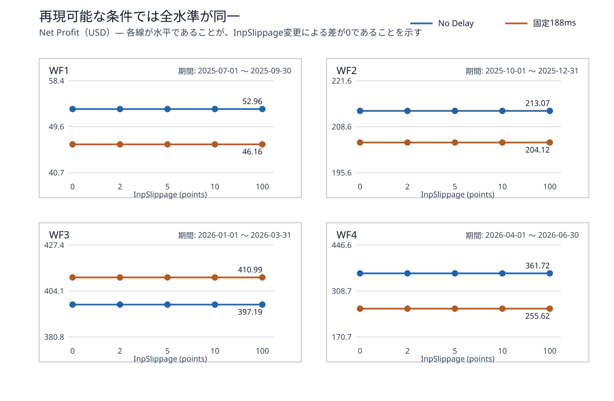
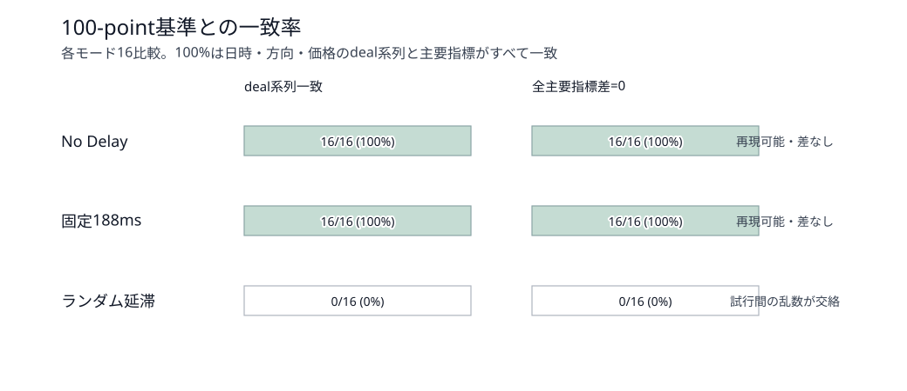
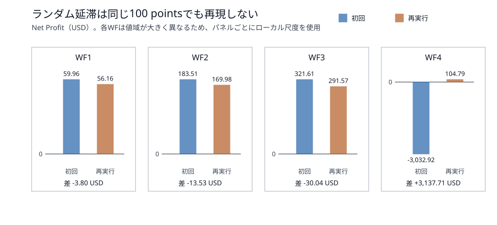

# スリッページ耐性検証 — 第2層：EA許容偏差（InpSlippage）感応度 総合報告書

- 実行状態: **SUCCESS（64/64件完了）**
- 対象: Quantum Queen X MT5 / WF1～WF4
- Deposit: 3,000 USD
- 評価水準: `InpSlippage = 0 / 2 / 5 / 10 / 100 points`
- 実行モード: No Delay / 固定188ms / ランダム延滞
- 最終実行完了: 2026-08-27T13:17:50+09:00

## 1. 目的

<span style="color:yellow;">本検証の目的は、Quantum Queen（QQ）のEA入力 InpSlippage を変更したとき、注文成立、取引系列、Net Profit、Trades、Profit Factor（PF）、Recovery Factor（RF）、Sharpe RatioおよびEquity Drawdown（DD）が変化するかを、4つのWalk Forward期間で確認することである。</span>

### 1.1 スリッページ検証で計画した3層の位置づけ

スリッページに関係する現象には、不利な約定価格、EAが許容する価格偏差、実口座で生じる約定差という性質の異なる要素がある。原因を分離するため、検証を次の3層に分けている。

| 層 | 位置づけ | 主に確認するもの | 状態 |
|---:|---|---|---|
| 第1層 | Bid/Ask価格シフトによるTransaction Cost Stress | 全EAを共通条件に置き、不利な価格入力に対する損益・DD・取引系列の感応度を確認 | 完了 |
| **第2層** | **EA側の許容価格偏差感応度** | QQの`InpSlippage`を変え、注文成立・取引欠落・取引系列・成績への影響を確認 | **今回完了** |
| 第3層 | 実環境の約定差観測 | デモまたは実運用相当環境で、注文要求価格と実約定価格の差を記録し、分布と市場条件の関係を評価 | 未実施 |

**今回は、この3層のうち第2層の検証である。** 第1層のようにBid/Askティックへ不利な価格を直接注入する試験ではなく、通常の`XAUUSD`を使い、EA入力`InpSlippage`だけを変更した。<span style="color:yellow;">このパラメータはQQだけがサポートしているので、今回の対象はQQのみである。</span>

第1層の報告書: [第1層 Transaction Cost Stress 総合報告書](../transaction_cost_stress/results/20260825T152053127504_081b75e8/transaction_cost_stress_stage1_comprehensive_report.md)

### 1.2 `InpSlippage`とは何か

<span style="color:yellow;">InpSlippageは、名称とMQL5の一般仕様から、EAが注文要求へ設定する「要求価格からの最大許容偏差」をpoints単位で表す入力と考えられる。</span>概念上は次の関係になる。

```text
|約定価格 - 注文時の要求価格| <= InpSlippage × Point
```

今回のXAUUSDでは`Point = 0.01 USD`であるため、各設定値は次の価格幅に相当する。

| InpSlippage | 価格幅 |
|---:|---:|
| 0 points | 0.00 USD |
| 2 points | 0.02 USD |
| 5 points | 0.05 USD |
| 10 points | 0.10 USD |
| 100 points | 1.00 USD |

<span style="color:yellow;">重要なのは、InpSlippageが「指定値だけ価格を滑らせる」設定ではないことである。</span>価格データ、Bid/Ask、スプレッド、損益へコストを直接追加せず、該当する注文方式で許容偏差判定が行われる場合の上限を指定する。MQL5では`MqlTradeRequest.deviation`がpoints単位の最大許容偏差であり、`CTrade::SetDeviationInPoints()`も同じ許容値を設定する。

- [MqlTradeRequest — MQL5 Reference](https://www.mql5.com/en/docs/constants/structures/mqltraderequest)
- [SetDeviationInPoints — MQL5 Reference](https://www.mql5.com/en/docs/standardlibrary/tradeclasses/ctrade/ctradesetdeviationinpoints)

<span style="color:yellow;">QQのソースコードは提供されておらず、暗号化された.ex5のみである。そのため、InpSlippageが実際にどの注文へどのAPIで適用されるかは直接確認できない。</span>この点は結果解釈上の制約である。

### 1.3 対象EAをQQだけとした理由

<span style="color:yellow;">今回確認した3EAのうち、注文許容偏差に相当する公開入力を持つのはQQのInpSlippageだけだった。</span>Smart Gold HunterとWave Riderには比較可能な公開入力がないため、<span style="color:yellow;">第2層のパラメータ感応度試験はQQだけを対象とした。</span>第1層では3EAを共通の加工価格で比較したが、第2層はEA固有の公開入力を評価する層である。

### 1.4 WF期間

期間は、これまでのWFOおよび第1層検証と同じ4期間である。

| WF | 検証期間 |
|---|---|
| WF1 | 2025-07-01 ～ 2025-09-30 |
| WF2 | 2025-10-01 ～ 2025-12-31 |
| WF3 | 2026-01-01 ～ 2026-03-31 |
| WF4 | 2026-04-01 ～ 2026-06-30 |

### 1.5 計算数

最初にNo Delayで5水準を比較し、差が観測されなかったため、注文処理中の価格変化が起き得る条件として固定188msとランダム延滞へ拡張した。さらにランダム延滞の再現性を確認するため、100 pointsを独立に再実行した。

```text
No Delay                 1 EA × 4 WF × 5水準 = 20
固定188ms                1 EA × 4 WF × 5水準 = 20
ランダム延滞             1 EA × 4 WF × 5水準 = 20
ランダム100再現性確認    1 EA × 4 WF × 1水準 =  4
合計                                             64バックテスト
```

この64件とは別に、No Delay/WF1の初回Safety Gate診断を1件実行した。これはSwap会計差の原因調査用であり、評価行列には含めない。

## 2. 結論

### 2.1 総合判断

<span style="color:yellow;">**再現可能なNo Delayおよび固定188msでは、InpSlippageの効果は「小さい」のではなく、今回の測定精度では観測されなかった。**</span>

- No Delay: 100以外の16/16ケースで、主要指標差がすべて0、deal系列が完全一致した。
- 固定188ms: 100以外の16/16ケースで、主要指標差がすべて0、deal系列が完全一致した。
- 合計: 再現可能な32/32比較で、`InpSlippage=0 / 2 / 5 / 10 / 100`の水準差はなかった。
- ランダム延滞: 水準間に差は出たが、同じ100 pointsを再実行しても4/4 WFで取引系列と指標が再現しなかった。したがって単発の水準差を`InpSlippage`の因果効果とは判定できない。

> 第2層の結論: QQの`InpSlippage`を0～100 pointsへ変更しても、再現可能なStrategy Tester条件では、注文成立、取引系列、約定価格および成績への効果を確認できなかった。

これは、実際のスリッページがQQへ与える影響が小さいことを意味しない。第1層では不利なBid/Ask価格入力による損益変化が観測されている。<span style="color:yellow;">第2層が示すのは、**QQの公開入力InpSlippageを変更しても、今回の注文経路では結果を制御できた証拠がない**ということである。</span>

### 2.2 再現可能な条件での感応度



No Delayと固定188msでは、各WF・各実行モードの線が全水準で水平になった。固定188msの水準そのものがNo Delayと異なるケースはあるが、これは延滞条件の違いによるものであり、同じ延滞条件内で`InpSlippage`を変えた効果ではない。



| 実行モード | 100以外の比較数 | deal系列が100と一致 | 全主要指標差が0 | 判定 |
|---|---:|---:|---:|---|
| No Delay | 16 | 16/16 | 16/16 | 効果を観測せず |
| 固定188ms | 16 | 16/16 | 16/16 | 効果を観測せず |
| ランダム延滞 | 16 | 0/16 | 0/16 | 乱数系列が交絡し比較不能 |

ここでいうdeal系列の一致とは、deal件数に加えて、各dealの日時・方向・約定価格を順番どおり比較したハッシュが一致することを指す。

### 2.3 ランダム延滞を効果判定に使えない理由



| WF | 初回 NP / Trades | 再実行 NP / Trades | NP差（再実行－初回） | deal系列 |
|---|---:|---:|---:|---|
| WF1 | 59.96 / 153 | 56.16 / 149 | -3.80 | 不一致 |
| WF2 | 183.51 / 201 | 169.98 / 206 | -13.53 | 不一致 |
| WF3 | 321.61 / 202 | 291.57 / 192 | -30.04 | 不一致 |
| WF4 | -3,032.92 / 116 | 104.79 / 194 | +3,137.71 | 不一致 |

同じEA、WF、Deposit、set、`InpSlippage=100`でも、ランダム延滞の初回と再実行は4WFすべてで異なった。特にWF4は初回-3,032.92 USDに対し、再実行104.79 USDである。この差は`InpSlippage`を固定したまま発生しているため、ランダム延滞内の単発比較には乱数系列の影響が強く混ざっている。

### <span style="color:yellow;">2.4 InpSlippageが効かなかった可能性</span>

今回の結果だけでは、次の可能性を分離できない。

1. XAUUSDの注文執行方式または対象注文では、許容偏差が使用されない。
2. QQ内部で`InpSlippage`が今回の注文へ適用されていない、または一部の操作だけに適用されている。
3. テスト中の価格変化が、許容偏差による拒否・再試行を発生させる条件にならなかった。

MQL5公式仕様では、Request ExecutionとInstant Executionの成行注文には`price`と`deviation`が必要だが、Market Executionの成行注文では必須ではない。QQのソースまたは注文要求ログがないため、どれが原因かは確定できない。

## 3. 詳細

### 3.1 固定条件

| 項目 | 条件 |
|---|---|
| EA | Quantum Queen X MT5 |
| Symbol / Timeframe | 通常のXAUUSD / H1 |
| Model | Every tick based on real ticks |
| Deposit / Leverage / Currency | 3,000 USD / 1:500 / USD |
| Optimization / Forward | OFF / OFF |
| `InpSlippage` | 0 / 2 / 5 / 10 / 100 points |
| 実行モード | No Delay / 固定188ms / ランダム延滞 |
| その他のEA入力 | 各WFのWFO選択済み専用setから変更なし |
| 比較基準 | 各実行モード・各WFの100 points |

元のWF専用setは変更せず、各実行フォルダへ`InpSlippage`の現在値だけを置換した派生setを生成した。実行前に、元setとの差が`InpSlippage`だけであることをプログラムで検証している。

### 3.2 データ監査

| 監査項目 | 結果 |
|---|---:|
| suite数 | 4 |
| 評価対象バックテスト | 64 |
| 成功 | 64/64 |
| 欠落成果物 | 0 |
| No Delayの100-point Safety Gate | 4/4 PASS相当 |
| 再現可能条件の非基準比較 | 32 |
| 主要指標差ゼロ | 32/32 |
| deal系列一致 | 32/32 |
| ランダム100再実行のdeal系列一致 | 0/4 |

実行完了時刻は、No Delay `2026-08-27T11:22:55+09:00`、固定188ms `2026-08-27T11:50:29+09:00`、ランダム初回 `2026-08-27T12:14:03+09:00`、ランダム再実行 `2026-08-27T13:17:50+09:00`である。

### 3.3 No Delay 全20件

| WF | InpSlippage | Net Profit | Trades | PF | RF | Sharpe | Equity DD | deals | 100とdeal一致 |
|---|---:|---:|---:|---:|---:|---:|---:|---:|---|
| WF1 | 0 | 52.96 | 147 | 1.25 | 0.52 | 2.93 | 3.36% | 294 | 一致 |
| WF1 | 2 | 52.96 | 147 | 1.25 | 0.52 | 2.93 | 3.36% | 294 | 一致 |
| WF1 | 5 | 52.96 | 147 | 1.25 | 0.52 | 2.93 | 3.36% | 294 | 一致 |
| WF1 | 10 | 52.96 | 147 | 1.25 | 0.52 | 2.93 | 3.36% | 294 | 一致 |
| WF1 | 100 | 52.96 | 147 | 1.25 | 0.52 | 2.93 | 3.36% | 294 | 基準 |
| WF2 | 0 | 213.07 | 199 | 2.04 | 5.16 | 30.97 | 1.37% | 398 | 一致 |
| WF2 | 2 | 213.07 | 199 | 2.04 | 5.16 | 30.97 | 1.37% | 398 | 一致 |
| WF2 | 5 | 213.07 | 199 | 2.04 | 5.16 | 30.97 | 1.37% | 398 | 一致 |
| WF2 | 10 | 213.07 | 199 | 2.04 | 5.16 | 30.97 | 1.37% | 398 | 一致 |
| WF2 | 100 | 213.07 | 199 | 2.04 | 5.16 | 30.97 | 1.37% | 398 | 基準 |
| WF3 | 0 | 397.19 | 165 | 2.60 | 2.70 | 36.77 | 4.33% | 330 | 一致 |
| WF3 | 2 | 397.19 | 165 | 2.60 | 2.70 | 36.77 | 4.33% | 330 | 一致 |
| WF3 | 5 | 397.19 | 165 | 2.60 | 2.70 | 36.77 | 4.33% | 330 | 一致 |
| WF3 | 10 | 397.19 | 165 | 2.60 | 2.70 | 36.77 | 4.33% | 330 | 一致 |
| WF3 | 100 | 397.19 | 165 | 2.60 | 2.70 | 36.77 | 4.33% | 330 | 基準 |
| WF4 | 0 | 361.72 | 181 | 3.04 | 3.40 | 43.18 | 3.47% | 362 | 一致 |
| WF4 | 2 | 361.72 | 181 | 3.04 | 3.40 | 43.18 | 3.47% | 362 | 一致 |
| WF4 | 5 | 361.72 | 181 | 3.04 | 3.40 | 43.18 | 3.47% | 362 | 一致 |
| WF4 | 10 | 361.72 | 181 | 3.04 | 3.40 | 43.18 | 3.47% | 362 | 一致 |
| WF4 | 100 | 361.72 | 181 | 3.04 | 3.40 | 43.18 | 3.47% | 362 | 基準 |

各WF内では、Net Profit、Trades、PF、RF、Sharpe、Equity DD、deal件数、deal系列が5水準すべて完全一致した。

### 3.4 固定188ms 全20件

| WF | InpSlippage | Net Profit | Trades | PF | RF | Sharpe | Equity DD | deals | 100とdeal一致 |
|---|---:|---:|---:|---:|---:|---:|---:|---:|---|
| WF1 | 0 | 46.16 | 146 | 1.22 | 0.48 | 2.68 | 3.22% | 292 | 一致 |
| WF1 | 2 | 46.16 | 146 | 1.22 | 0.48 | 2.68 | 3.22% | 292 | 一致 |
| WF1 | 5 | 46.16 | 146 | 1.22 | 0.48 | 2.68 | 3.22% | 292 | 一致 |
| WF1 | 10 | 46.16 | 146 | 1.22 | 0.48 | 2.68 | 3.22% | 292 | 一致 |
| WF1 | 100 | 46.16 | 146 | 1.22 | 0.48 | 2.68 | 3.22% | 292 | 基準 |
| WF2 | 0 | 204.12 | 203 | 1.89 | 1.64 | 19.02 | 4.14% | 406 | 一致 |
| WF2 | 2 | 204.12 | 203 | 1.89 | 1.64 | 19.02 | 4.14% | 406 | 一致 |
| WF2 | 5 | 204.12 | 203 | 1.89 | 1.64 | 19.02 | 4.14% | 406 | 一致 |
| WF2 | 10 | 204.12 | 203 | 1.89 | 1.64 | 19.02 | 4.14% | 406 | 一致 |
| WF2 | 100 | 204.12 | 203 | 1.89 | 1.64 | 19.02 | 4.14% | 406 | 基準 |
| WF3 | 0 | 410.99 | 174 | 2.76 | 3.34 | 36.89 | 3.88% | 348 | 一致 |
| WF3 | 2 | 410.99 | 174 | 2.76 | 3.34 | 36.89 | 3.88% | 348 | 一致 |
| WF3 | 5 | 410.99 | 174 | 2.76 | 3.34 | 36.89 | 3.88% | 348 | 一致 |
| WF3 | 10 | 410.99 | 174 | 2.76 | 3.34 | 36.89 | 3.88% | 348 | 一致 |
| WF3 | 100 | 410.99 | 174 | 2.76 | 3.34 | 36.89 | 3.88% | 348 | 基準 |
| WF4 | 0 | 255.62 | 189 | 2.28 | 2.37 | 27.35 | 3.54% | 378 | 一致 |
| WF4 | 2 | 255.62 | 189 | 2.28 | 2.37 | 27.35 | 3.54% | 378 | 一致 |
| WF4 | 5 | 255.62 | 189 | 2.28 | 2.37 | 27.35 | 3.54% | 378 | 一致 |
| WF4 | 10 | 255.62 | 189 | 2.28 | 2.37 | 27.35 | 3.54% | 378 | 一致 |
| WF4 | 100 | 255.62 | 189 | 2.28 | 2.37 | 27.35 | 3.54% | 378 | 基準 |

固定188msはNo Delayとは異なる取引経路になったが、各WF内では5つの`InpSlippage`水準が完全一致した。したがって、観測されたモード間差は延滞条件の効果であり、`InpSlippage`水準の効果ではない。

### 3.5 ランダム延滞 全20件

| WF | InpSlippage | Net Profit | Trades | PF | RF | Sharpe | Equity DD | deals | 100とdeal一致 |
|---|---:|---:|---:|---:|---:|---:|---:|---:|---|
| WF1 | 0 | 57.70 | 149 | 1.26 | 0.58 | 3.04 | 3.25% | 298 | 不一致 |
| WF1 | 2 | 50.43 | 156 | 1.22 | 0.50 | 2.57 | 3.37% | 312 | 不一致 |
| WF1 | 5 | 64.24 | 146 | 1.30 | 0.66 | 3.50 | 3.24% | 292 | 不一致 |
| WF1 | 10 | 55.43 | 148 | 1.25 | 0.56 | 3.00 | 3.29% | 296 | 不一致 |
| WF1 | 100 | 59.96 | 153 | 1.27 | 0.60 | 3.23 | 3.32% | 306 | 基準 |
| WF2 | 0 | 193.00 | 207 | 1.79 | 1.45 | 17.60 | 4.42% | 414 | 不一致 |
| WF2 | 2 | 179.60 | 208 | 1.73 | 1.35 | 16.71 | 4.42% | 416 | 不一致 |
| WF2 | 5 | 156.55 | 203 | 1.63 | 1.21 | 14.85 | 4.28% | 406 | 不一致 |
| WF2 | 10 | 157.99 | 205 | 1.68 | 1.42 | 15.27 | 3.64% | 410 | 不一致 |
| WF2 | 100 | 183.51 | 201 | 1.85 | 1.84 | 19.80 | 3.30% | 402 | 基準 |
| WF3 | 0 | 225.58 | 197 | 1.61 | 1.13 | 13.57 | 6.42% | 394 | 不一致 |
| WF3 | 2 | 236.14 | 193 | 1.69 | 1.34 | 15.00 | 5.65% | 386 | 不一致 |
| WF3 | 5 | 257.95 | 198 | 1.72 | 1.28 | 17.05 | 6.44% | 396 | 不一致 |
| WF3 | 10 | 278.87 | 189 | 1.85 | 1.36 | 20.12 | 6.51% | 378 | 不一致 |
| WF3 | 100 | 321.61 | 202 | 1.78 | 0.77 | 11.17 | 12.99% | 404 | 基準 |
| WF4 | 0 | 150.88 | 199 | 1.52 | 0.99 | 11.75 | 5.04% | 398 | 不一致 |
| WF4 | 2 | -2,985.42 | 107 | 0.07 | -0.98 | -5.00 | 99.52% | 214 | 不一致 |
| WF4 | 5 | 150.00 | 185 | 1.63 | 1.20 | 13.63 | 4.13% | 370 | 不一致 |
| WF4 | 10 | 55.65 | 203 | 1.17 | 0.39 | 4.04 | 4.71% | 406 | 不一致 |
| WF4 | 100 | -3,032.92 | 116 | 0.07 | -0.97 | -5.00 | 101.06% | 232 | 基準 |

ランダム延滞では各水準が100-point基準と一致しなかった。しかし、100 points自体が独立再実行で再現しないため、この表の水準差を`InpSlippage`の効果として順位づけしない。

### 3.6 ランダム延滞100 points再実行 全4件

| WF | InpSlippage | Net Profit | Trades | PF | RF | Sharpe | Equity DD | deals | 100とdeal一致 |
|---|---:|---:|---:|---:|---:|---:|---:|---:|---|
| WF1 | 100 | 56.16 | 149 | 1.25 | 0.57 | 2.94 | 3.27% | 298 | 基準 |
| WF2 | 100 | 169.98 | 206 | 1.75 | 4.02 | 25.79 | 1.36% | 412 | 基準 |
| WF3 | 100 | 291.57 | 192 | 1.84 | 1.45 | 16.55 | 6.48% | 384 | 基準 |
| WF4 | 100 | 104.79 | 194 | 1.39 | 0.73 | 8.14 | 4.72% | 388 | 基準 |

この4件は感応度水準を追加する試験ではなく、ランダム延滞結果の再現性を監査する対照試験である。

### 3.7 Safety Gateとminor accounting difference

No Delay/WF1/100 pointsは、過去の自動結果53.91 USDに対して52.96 USDとなった。Trades 147、294 deals、dealの日時・方向・約定価格ハッシュ、Commission、deal Profit、EA SHA-256、元set SHA-256は一致した。差-0.95 USDはSwapの変化だけで完全に説明できた。

| 会計項目 | 過去の自動基準 | 今回 | 差 |
|---|---:|---:|---:|
| Commission | -105.84 | -105.84 | 0.00 |
| Swap | -20.16 | -21.11 | -0.95 |
| deal Profit | 179.91 | 179.91 | 0.00 |
| Net Profit | 53.91 | 52.96 | -0.95 |

このため、第2層の現在環境内比較に限って`PASS_WITH_ACCOUNTING_DRIFT`とし、52.96 USDをNo Delayの100-point基準に採用した。これは将来の再現性確認用に`minor accounting difference`として扱う。既存Capital Stressの一般Safety Gateは変更していない。

### 3.8 制約

- `InpSlippage`は実スリッページを注入する設定ではなく、許容偏差の入力である。
- QQの`.mq5`ソースがないため、入力がどの注文要求へ渡されるかを直接監査できない。
- Strategy Testerの固定延滞は決定論的比較に使えるが、実市場の約定差分布そのものではない。
- ランダム延滞は同一設定でも再現しなかったため、今回の単発結果から`InpSlippage`の因果効果を推定できない。
- 第2層の対象は公開入力を持つQQだけであり、3EAの優劣比較ではない。
- 実環境における要求価格と約定価格の差、リクオート、部分約定、流動性、ニュース時の非対称性は第3層の対象である。

### 3.9 成果物

| 内容 | 保存先 |
|---|---|
| 本総合報告書 | `data/slippage_tolerance/slippage_tolerance_layer2_comprehensive_report.md` |
| グラフ | `data/slippage_tolerance/report_assets/` |
| No Delay | `data/slippage_tolerance/results/20260827T104639296710_c0402bcb` |
| 固定188ms | `data/slippage_tolerance/results/20260827T112608629671_8d8f4073` |
| ランダム延滞・初回 | `data/slippage_tolerance/results/20260827T115048419627_1a1739ac` |
| ランダム延滞・100再実行 | `data/slippage_tolerance/results/20260827T131110348291_4fed8144` |

各実行フォルダにはsuite manifest、派生set、tester.ini、MT5 HTMLレポート、チャート画像、`result.json`を保存している。`data/`以下は既定方針どおりGit管理対象外である。
