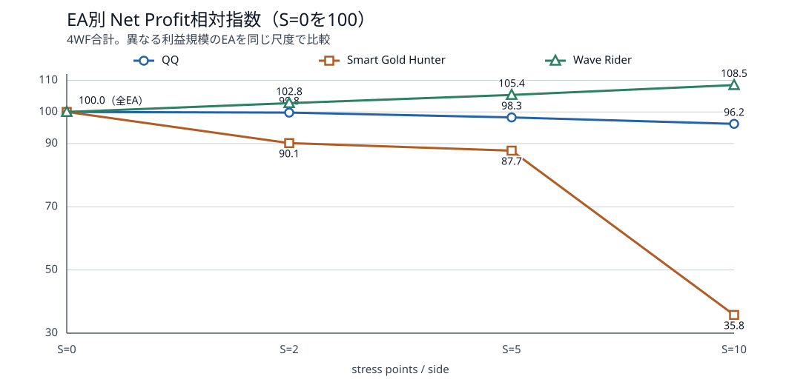
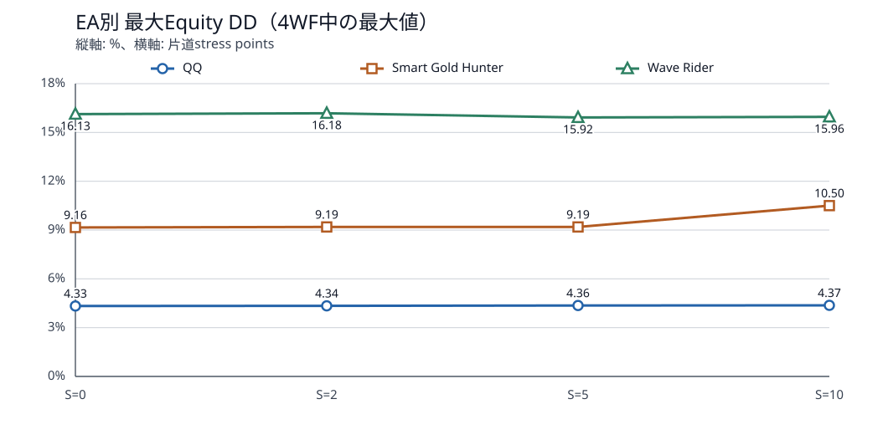
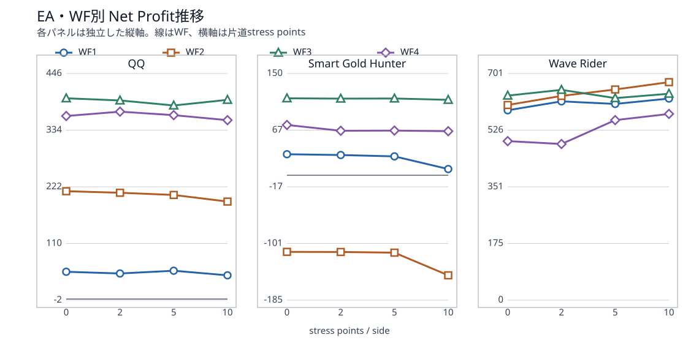

# スリッページ耐性検証 — 第1層：Bid/Ask価格シフトによるTransaction Cost Stress 総合報告書

- 実行状態: **SUCCESS（48/48件完了）**
- 完了日時（JST）: 2026-08-26T13:50:34+09:00
- 対象: Quantum Queen、Smart Gold Hunter、Wave Rider × WF1～WF4
- Deposit: 3,000 USD
- 評価水準: 片道ストレス水準（S）=0 / 2 / 5 / 10 points
- 報告書改訂:
  - 2026-08-26 Bid/Ask加工の意味と第1層の狙いを追記
  - 2026-08-26 3層評価の位置づけ、4WF期間、48通りの計算構成を追記
  - 2026-08-26 Markdown暗色プレビューでのグラフ文字・背景・線の視認性を改善
  - 2026-08-26 1.2でSを先に定義し、1.3の詳細式へつながる構成に改善
  - 2026-08-27 タイトルをスリッページ耐性検証と第1層の評価方法が明確になる表現へ変更

## 1. 目的

<span style="color:yellow;">本検証の目的は、3つのEAについて、XAUUSDの売買価格が継続的に不利になった場合の損益、取引系列、ドローダウンおよび主要指標の変化を、各Walk Forward期間で比較することである。</span>

### 1.1 スリッページ検証で計画した3層の位置づけ

<span style="color:yellow;">スリッページには、価格が不利になること、EAが許容する価格偏差、ブローカーで実際に発生する約定差など、性質の異なる要素が含まれる。</span>1つのバックテストだけでこれらを同時に再現すると原因を分離できないため、検証を次の3層に分けて進める計画とした。

| 層 | 位置づけ | 主に確認するもの | 状態 |
|---:|---|---|---|
| 第1層 | 不利約定価格・取引コストストレス | Bid/Askを一定幅だけ不利にし、損益・DD・取引系列・EA内部ロジックの感応度を共通条件で比較 | **今回実施・完了** |
| 第2層 | EA側の注文許容条件・偏差耐性 | EAに許容偏差やSlippage入力がある場合、その設定による注文成立・拒否・取引欠落への影響を評価。強制的な約定差そのものではない | 未実施 |
| 第3層 | 実環境の約定差観測 | デモまたは実運用相当環境で、注文要求価格と実際の約定価格を記録し、ブローカー、流動性、時間帯、遅延を含む実スリッページ分布を評価 | 未実施 |

<span style="color:yellow;">**今回の48件の計算は、この3層のうち第1層だけを対象とした検証である。** 第2層と第3層の結果は本報告書に含まれず、今回の結果だけで実市場のスリッページ耐性を最終確定するものではない。</span>

### 1.2 4つのWF期間・ストレス水準S・計算数

今回もこれまでの検証と同じ4つのWF（Walk Forward、以下WF）期間を使用した。各WFで、選択済みの専用set（先に最適化したパラメータ）と先と同じ期間を用いた。

| WF | 検証期間 |
|---|---|
| WF1 | 2025-07-01～2025-09-30 |
| WF2 | 2025-10-01～2025-12-31 |
| WF3 | 2026-01-01～2026-03-31 |
| WF4 | 2026-04-01～2026-06-30 |

本検証では、<span style="color:yellow;">Bid側とAsk側のそれぞれに加える **片道の不利幅を表すストレス水準をS** と呼ぶ。</span>単位はpointで、`S=0 / 2 / 5 / 10`の4水準を使用した。<span style="color:yellow;">S=0は価格を変えず、S>0は数値が大きいほど不利幅が大きいストレス条件となる。</span>Bid/Askへ適用する正確な式と価格例は1.3で説明する。

このSの4水準を各EA・各WFへ適用した。計算数は次のとおりである。

```text
3 EA × 4 WF × 4 S水準 = 48バックテスト

S=0（再現基準）: 3 EA × 4 WF = 12件
S>0（ストレス）: 3 EA × 4 WF × 3水準 = 36件
合計: 12 + 36 = 48件
```

### 1.3 第1層のBid/Ask加工式

<span style="color:yellow;">MT5 Strategy Testerには任意の実約定スリッページを直接注入する一般設定がないため、第1層では元XAUUSDティックを次のように加工したカスタムシンボルを用いた。</span>

```text
Bid' = Bid - S × Point
Ask' = Ask + S × Point
```

|カスタムシンボル|保存される価格|
|---|---|
|XAUUSD_TCS0_...|Bid/Askとも元データと同じ|
|XAUUSD_TCS2_...|S=2としたデータ|
|XAUUSD_TCS5_...|S=5としたデータ|
|XAUUSD_TCS10_...|S=10としたデータ|

各カスタムシンボルには、元のXAUUSDティックを上式で加工したBid/Askが収められている。

#### 1.3.1 式が意味するもの

`Bid`は市場参加者が売るときに使う価格、`Ask`は買うときに使う価格である。プライム記号（`'`）の付いた`Bid'`と`Ask'`は、本検証用に加工した価格を表す。`S`は片道のストレス水準、`Point`は銘柄の最小価格単位で、今回のXAUUSDでは0.01 USDである。

 <span style="color:yellow;">Bid' = Bid - S × PointはBidを低くし、売却価格を不利にする。Ask' = Ask + S × PointはAskを高くし、購入価格を不利にする。BidとAskを同時に外側へ広げるため、元のスプレッドに対する追加幅は2 × S × Pointとなる。</span>

例として、元価格がBid=2,400.00、Ask=2,400.17、S=5の場合は次のようになる。

```text
Bid' = 2,400.00 - 5 × 0.01 = 2,399.95
Ask' = 2,400.17 + 5 × 0.01 = 2,400.22
元スプレッド     = 0.17 USD
加工後スプレッド = 0.27 USD（0.10 USD増加）
```

| S（points/side） | Bidの低下幅 | Askの上昇幅 | 追加スプレッド |
|---:|---:|---:|---:|
| 0 | 0.00 USD | 0.00 USD | 0.00 USD |
| 2 | 0.02 USD | 0.02 USD | 0.04 USD |
| 5 | 0.05 USD | 0.05 USD | 0.10 USD |
| 10 | 0.10 USD | 0.10 USD | 0.20 USD |

### 1.4 売買への影響

| 売買場面 | 使用価格 | 加工による影響 |
|---|---|---|
| 買いエントリー | Ask' | 元Askより高く買うため不利 |
| 買い決済 | Bid' | 元Bidより低く売るため不利 |
| 売りエントリー | Bid' | 元Bidより低く売るため不利 |
| 売り決済 | Ask' | 元Askより高く買い戻すため不利 |

取引時刻・数量・方向がS=0と完全に同じなら、1回の往復取引には追加で概ね`2 × S × Point`の不利幅が生じる。ただし実際の本検証では、加工価格をEA自身が参照するため、エントリー、決済、フィルター、指標値も変化し得る。したがって、実測損益差は単純な追加コストだけではなく、取引系列の変化も含む。

### 1.5 スリッページの何を実現しようとしているか

<span style="color:yellow;">本検証が第1層で実現しようとしているのは、実スリッページのうち、**約定価格が意図した価格より不利になる方向性と、その不利幅がEAへ与える影響**である。すべてのティックに一定の不利幅を与えることで、EA間・WF間・水準間を同じ条件で比較できる再現可能な感応度試験としている。</span>

具体的には、次の2点を同時に観測する。

1. 取引系列が同じ場合に、追加の不利価格が損益やDDをどの程度悪化させるか。
2. 不利なBid/AskをEAへ入力した場合に、注文条件や内部ロジックが反応して取引数・時刻・方向をどのように変えるか。

一方、実市場のスリッページにある注文ごとのランダム性、約定方向ごとの非対称性、ニュース時の急拡大、注文拒否・リクオート、板の厚み、部分約定、通信・約定遅延との相互作用は、この第1層では再現していない。これらは後続層で分離して評価すべき要素である。

したがって、<span style="color:yellow;">これは**純粋な約定スリッページ検証ではなく、不利約定価格・取引コストストレス**である。価格加工に対するEA内部ロジックの反応や取引系列の変化も結果に含まれる。</span>

| 固定条件 | 内容 |
|---|---|
| Symbol / Timeframe | XAUUSD相当カスタムシンボル / H1 |
| Model | Every tick based on real ticks |
| Execution delay | No Delay |
| Deposit / Leverage / Currency | 3,000 USD / 1:500 / USD |
| Optimization / Forward | OFF / OFF |
| EAパラメータ | 各WFでWFO選択済みの専用setを固定 |
| Commission | 72 USD/lotをentry時に往復分一括計上 |

## 2. 結論

### 2.1 総合判断

- **Quantum Queen:** S=10で4WF合計Net Profitは1,026.34 USDから987.56 USDへ3.78%低下した。最大Equity DDは4.33%から4.37%への小幅上昇であり、<span style="color:yellow;">今回の範囲では比較的緩やかな劣化だった。</span>
- **Smart Gold Hunter:** S=10で4WF合計Net Profitは105.96 USDから37.90 USDへ64.23%低下し、最大Equity DDも9.16%から10.50%へ上昇した。<span style="color:yellow;">3EAの中で最も明確なコスト感応性が確認された。</span>
- **Wave Rider:** <span style="color:yellow;">S上昇に伴い4WF合計Net Profitと取引数が増加した。ただし取引系列(※)が変化しており、これは不利価格が利益を直接改善したことを意味しない。</span>特にWF3ではS=10でEquity DDが5.16%から8.55%へ上昇し、RFは4.01から2.19へ低下した。
- **総括:** 第1層だけで純粋なスリッページ耐性の順位を確定することはできない。<span style="color:yellow;">QQは比較的安定、Smart Gold Hunterは明確に悪化、Wave Riderは内部ロジック反応が大きく非単調、という特徴が得られた。</span>

※取引系列の変化とは以下のことを指す。
- エントリー日時が変わる
- 売買方向が変わる
- 一部の取引が消える
- 新しい取引が発生する
- 取引回数が変わる
- その後の保有状態や決済も変わる



### 2.2 EA別集計

| EA | S=0 Net Profit合計 | S=10 Net Profit合計 | 変化額 | 変化率 | Trades S=0→10 | 最大DD S=0→10 |
|---|---:|---:|---:|---:|---:|---:|
| Quantum Queen (QQ) | 1026.34 | 987.56 | -38.78 | -3.78% | 692→698 | 4.33%→4.37% |
| Smart Gold Hunter | 105.96 | 37.90 | -68.06 | -64.23% | 241→241 | 9.16%→10.50% |
| Wave Rider | 2315.25 | 2512.37 | +197.12 | +8.51% | 1466→1489 | 16.13%→15.96% |



### 2.3 判断上の注意

S>0ではBid/Askだけでなく、実ティック欠損区間を補うM1 OHLCとspreadにも同じストレスを適用している。EAが価格条件、指標、注文条件などへ反応すると、新規注文の有無や時刻が変わる。そのため、<span style="color:yellow;">S増加に対して損益が単調に低下しないケースは、手数料効果だけでなく**戦略の経路依存性**を示している。</span>
戦略の経路依存性とは、EAの判断が現在の価格だけで決まらず、それまでに価格がどのように動き、どの取引を行ってきたかにも左右される性質のことである。

## 3. 詳細

### 3.1 テスト設計とデータ監査

| 項目 | 確認結果 |
|---|---:|
| 元ティック件数（各水準） | 276,996,989 |
| M1バー件数（各水準） | 883,909 |
| Point / Tick Size | 0.01 / 0.01 |
| 元スプレッド p50 / p95 / p99 | 17 / 26 / 43 points |
| S=0 Safety Gate | 12/12 PASS |
| 完了組合せ | 48/48、重複0 |
| 欠落成果物 | 0 |

S=0では全EA・全WFについて、Trades、deal日時・方向・価格系列、Net Profit許容差、Equity DDおよび主要指標を既存XAUUSD基準と照合し、全12件がPASSした。これにより、カスタムシンボル生成経路が通常基準を再現できることを確認した。

### 3.2 WF期間

| WF | 検証期間 |
|---|---|
| WF1 | 2025-07-01～2025-09-30 |
| WF2 | 2025-10-01～2025-12-31 |
| WF3 | 2026-01-01～2026-03-31 |
| WF4 | 2026-04-01～2026-06-30 |

### 3.3 Net ProfitのWF別推移



#### Quantum Queen (QQ)

| WF | S=0 | S=2 | S=5 | S=10 | S=10−S=0 |
|---|---:|---:|---:|---:|---:|
| WF1 | 53.91 | 50.59 | 56.05 | 46.88 | -7.03 |
| WF2 | 213.27 | 210.29 | 205.91 | 192.81 | -20.46 |
| WF3 | 397.10 | 392.77 | 382.93 | 394.09 | -3.01 |
| WF4 | 362.06 | 370.62 | 363.79 | 353.78 | -8.28 |

#### Smart Gold Hunter

| WF | S=0 | S=2 | S=5 | S=10 | S=10−S=0 |
|---|---:|---:|---:|---:|---:|
| WF1 | 31.08 | 29.91 | 27.93 | 9.20 | -21.88 |
| WF2 | -113.27 | -113.42 | -114.42 | -147.97 | -34.70 |
| WF3 | 113.78 | 113.26 | 113.47 | 111.53 | -2.25 |
| WF4 | 74.37 | 65.76 | 65.99 | 65.14 | -9.23 |

#### Wave Rider

| WF | S=0 | S=2 | S=5 | S=10 | S=10−S=0 |
|---|---:|---:|---:|---:|---:|
| WF1 | 587.27 | 614.79 | 606.80 | 623.61 | +36.34 |
| WF2 | 603.59 | 631.74 | 651.65 | 674.24 | +70.65 |
| WF3 | 632.62 | 650.46 | 624.93 | 638.50 | +5.88 |
| WF4 | 491.77 | 483.00 | 556.76 | 576.02 | +84.25 |

### 3.4 水準別のEA集計

| EA | S | Net Profit合計 | Trades合計 | 最大Equity DD |
|---|---:|---:|---:|---:|
| Quantum Queen (QQ) | 0 | 1026.34 | 692 | 4.33% |
| Quantum Queen (QQ) | 2 | 1024.27 | 693 | 4.34% |
| Quantum Queen (QQ) | 5 | 1008.68 | 689 | 4.36% |
| Quantum Queen (QQ) | 10 | 987.56 | 698 | 4.37% |
| Smart Gold Hunter | 0 | 105.96 | 241 | 9.16% |
| Smart Gold Hunter | 2 | 95.51 | 241 | 9.19% |
| Smart Gold Hunter | 5 | 92.97 | 241 | 9.19% |
| Smart Gold Hunter | 10 | 37.90 | 241 | 10.50% |
| Wave Rider | 0 | 2315.25 | 1466 | 16.13% |
| Wave Rider | 2 | 2379.99 | 1482 | 16.18% |
| Wave Rider | 5 | 2440.14 | 1488 | 15.92% |
| Wave Rider | 10 | 2512.37 | 1489 | 15.96% |

### 3.5 全48件の主要指標

| EA | WF | S | Net Profit | Trades | PF | RF | Sharpe | Equity DD |
|---|---|---:|---:|---:|---:|---:|---:|---:|
| QQ | WF1 | 0 | 53.91 | 147 | 1.25 | 0.54 | 2.99 | 3.35% |
| QQ | WF2 | 0 | 213.27 | 199 | 2.04 | 5.16 | 31.00 | 1.37% |
| QQ | WF3 | 0 | 397.10 | 165 | 2.60 | 2.70 | 36.77 | 4.33% |
| QQ | WF4 | 0 | 362.06 | 181 | 3.04 | 3.40 | 43.22 | 3.47% |
| Smart Gold Hunter | WF1 | 0 | 31.08 | 91 | 1.04 | 0.23 | 0.75 | 4.33% |
| Smart Gold Hunter | WF2 | 0 | -113.27 | 90 | 0.87 | -0.40 | -3.81 | 9.16% |
| Smart Gold Hunter | WF3 | 0 | 113.78 | 33 | 2.74 | 9.13 | 136.16 | 0.42% |
| Smart Gold Hunter | WF4 | 0 | 74.37 | 27 | 2.40 | 4.07 | 114.67 | 0.61% |
| Wave Rider | WF1 | 0 | 587.27 | 382 | 2.37 | 2.26 | 12.71 | 7.37% |
| Wave Rider | WF2 | 0 | 603.59 | 461 | 2.00 | 2.58 | 13.95 | 6.92% |
| Wave Rider | WF3 | 0 | 632.62 | 378 | 2.38 | 4.01 | 29.68 | 5.16% |
| Wave Rider | WF4 | 0 | 491.77 | 245 | 2.56 | 0.89 | 8.10 | 16.13% |
| QQ | WF1 | 2 | 50.59 | 149 | 1.23 | 0.50 | 2.77 | 3.39% |
| QQ | WF2 | 2 | 210.29 | 198 | 2.03 | 5.07 | 30.48 | 1.38% |
| QQ | WF3 | 2 | 392.77 | 164 | 2.59 | 2.67 | 36.32 | 4.34% |
| QQ | WF4 | 2 | 370.62 | 182 | 3.08 | 3.47 | 43.54 | 3.48% |
| Smart Gold Hunter | WF1 | 2 | 29.91 | 91 | 1.04 | 0.22 | 0.72 | 4.33% |
| Smart Gold Hunter | WF2 | 2 | -113.42 | 90 | 0.87 | -0.40 | -3.76 | 9.19% |
| Smart Gold Hunter | WF3 | 2 | 113.26 | 33 | 2.73 | 9.04 | 135.88 | 0.42% |
| Smart Gold Hunter | WF4 | 2 | 65.76 | 27 | 2.15 | 3.17 | 100.52 | 0.69% |
| Wave Rider | WF1 | 2 | 614.79 | 391 | 2.32 | 2.36 | 11.43 | 7.36% |
| Wave Rider | WF2 | 2 | 631.74 | 463 | 2.03 | 2.69 | 13.86 | 6.93% |
| Wave Rider | WF3 | 2 | 650.46 | 384 | 2.39 | 4.12 | 29.29 | 5.17% |
| Wave Rider | WF4 | 2 | 483.00 | 244 | 2.52 | 0.88 | 7.91 | 16.18% |
| QQ | WF1 | 5 | 56.05 | 143 | 1.27 | 0.54 | 3.01 | 3.45% |
| QQ | WF2 | 5 | 205.91 | 199 | 1.99 | 4.92 | 29.17 | 1.39% |
| QQ | WF3 | 5 | 382.93 | 164 | 2.54 | 2.60 | 35.40 | 4.36% |
| QQ | WF4 | 5 | 363.79 | 183 | 3.02 | 3.39 | 41.79 | 3.50% |
| Smart Gold Hunter | WF1 | 5 | 27.93 | 91 | 1.04 | 0.21 | 0.67 | 4.35% |
| Smart Gold Hunter | WF2 | 5 | -114.42 | 90 | 0.87 | -0.40 | -3.79 | 9.19% |
| Smart Gold Hunter | WF3 | 5 | 113.47 | 33 | 2.76 | 9.02 | 136.59 | 0.42% |
| Smart Gold Hunter | WF4 | 5 | 65.99 | 27 | 2.16 | 3.22 | 101.00 | 0.68% |
| Wave Rider | WF1 | 5 | 606.80 | 388 | 2.30 | 2.32 | 11.21 | 7.36% |
| Wave Rider | WF2 | 5 | 651.65 | 463 | 2.07 | 2.77 | 14.22 | 6.88% |
| Wave Rider | WF3 | 5 | 624.93 | 386 | 2.25 | 2.16 | 19.49 | 8.47% |
| Wave Rider | WF4 | 5 | 556.76 | 251 | 2.76 | 1.01 | 8.76 | 15.92% |
| QQ | WF1 | 10 | 46.88 | 146 | 1.21 | 0.44 | 2.35 | 3.52% |
| QQ | WF2 | 10 | 192.81 | 197 | 1.92 | 4.54 | 26.31 | 1.41% |
| QQ | WF3 | 10 | 394.09 | 172 | 2.42 | 2.66 | 31.67 | 4.37% |
| QQ | WF4 | 10 | 353.78 | 183 | 2.94 | 3.28 | 40.37 | 3.53% |
| Smart Gold Hunter | WF1 | 10 | 9.20 | 91 | 1.01 | 0.07 | 0.22 | 4.37% |
| Smart Gold Hunter | WF2 | 10 | -147.97 | 90 | 0.83 | -0.45 | -5.00 | 10.50% |
| Smart Gold Hunter | WF3 | 10 | 111.53 | 33 | 2.72 | 8.85 | 134.68 | 0.42% |
| Smart Gold Hunter | WF4 | 10 | 65.14 | 27 | 2.14 | 3.13 | 98.46 | 0.69% |
| Wave Rider | WF1 | 10 | 623.61 | 391 | 2.31 | 2.38 | 10.82 | 7.44% |
| Wave Rider | WF2 | 10 | 674.24 | 458 | 2.12 | 2.86 | 13.97 | 6.86% |
| Wave Rider | WF3 | 10 | 638.50 | 384 | 2.28 | 2.19 | 19.49 | 8.55% |
| Wave Rider | WF4 | 10 | 576.02 | 256 | 2.77 | 1.03 | 8.61 | 15.96% |

### 3.6 EA別の詳細解釈

#### Quantum Queen

4WF合計ではS上昇に伴い緩やかに利益が低下したが、WF1ではS=5、WF4ではS=2でS=0を上回り、完全な単調劣化ではない。S=10でも最大DDの増加は0.04 percentage pointにとどまった。一方、取引数が水準ごとに変化しているため、純粋なコスト控除だけでなくシグナル経路の変化を含む。

#### Smart Gold Hunter

取引数は全水準で合計241のままだが、S=10で損益が大幅に悪化した。主因はWF1の31.08→9.20 USDと、もともと赤字だったWF2の-113.27→-147.97 USDである。WF3は比較的安定しているため、WFごとの市場状態によりコスト感応性が大きく異なる。

#### Wave Rider

4WF合計利益はS上昇とともに増えたが、Tradesも1,466→1,489へ増加し、deal系列が変化した。特にWF3はS=5・10でDDとRFが悪化している。したがって、集計利益の増加だけから耐性が高い、または不利価格が有利と結論づけることはできず、次層で約定イベント寄りの評価が必要である。

### 3.7 制約と次の検証

- 本検証は継続的なBid/Ask拡張であり、注文ごとに確率的に発生する実スリッページではない。
- No Delay固定のため、遅延と価格変化の複合効果は含まない。
- S>0で取引系列が変わるため、損益差を単純な『約定数量×スリッページ』として分解できない。
- 次層では、EAごとの許容偏差・注文拒否特性や、可能なら約定イベント単位の価格差を分離して評価する。

### 3.8 成果物

- [簡易サマリー](summary.md)
- [全結果・監査マニフェスト](suite_manifest.json)
- 各EA/WFの`stress_00000`、`stress_00002`、`stress_00005`、`stress_00010`配下にHTMLレポート、グラフ画像、`tester.ini`、Commission設定コピー、`result.json`を保存
- 本フォルダは`data/`配下でありGit管理対象外
