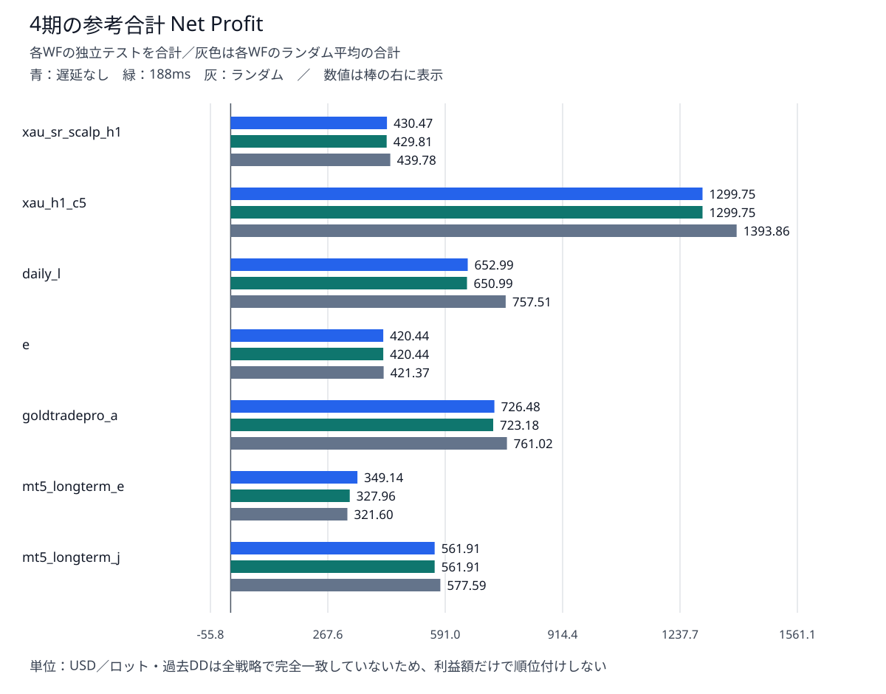
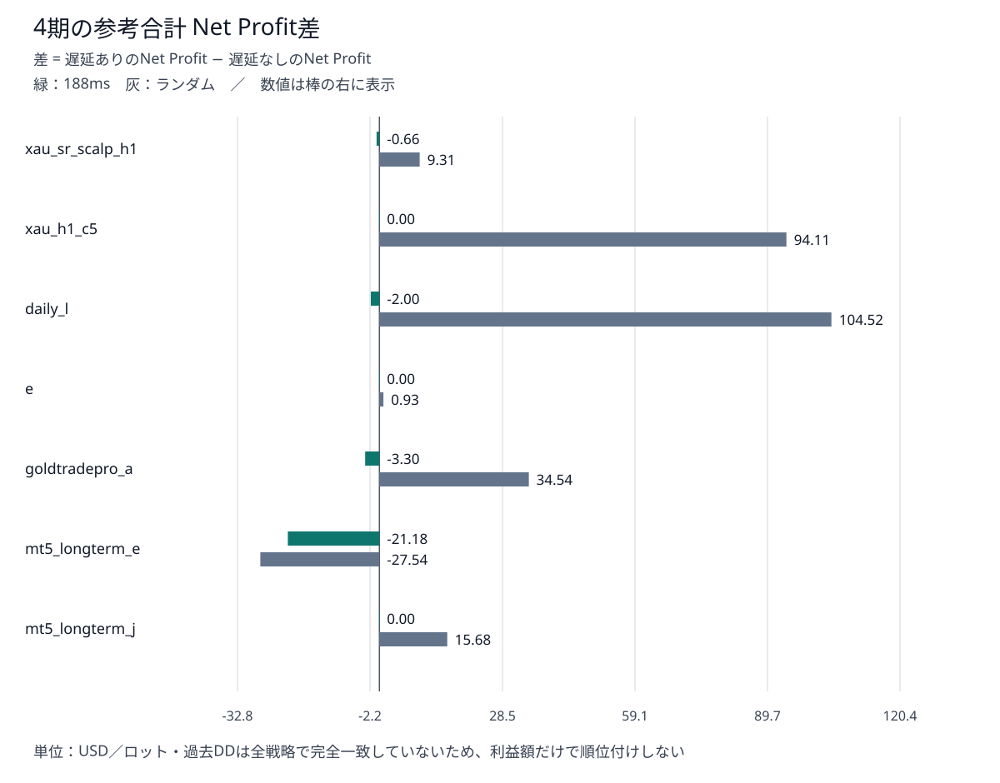
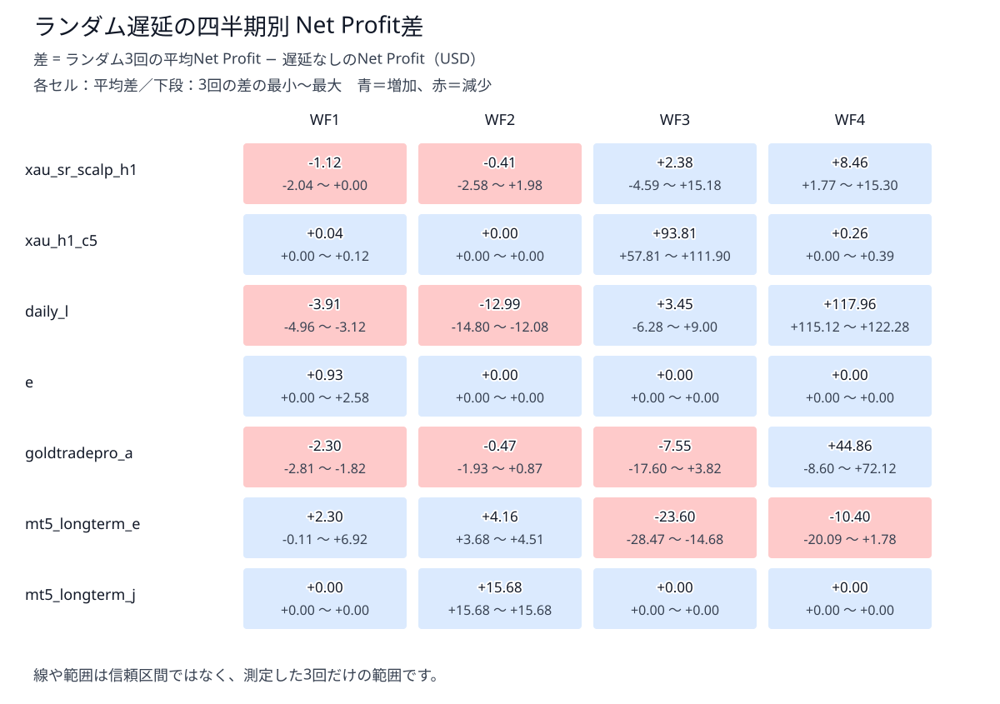
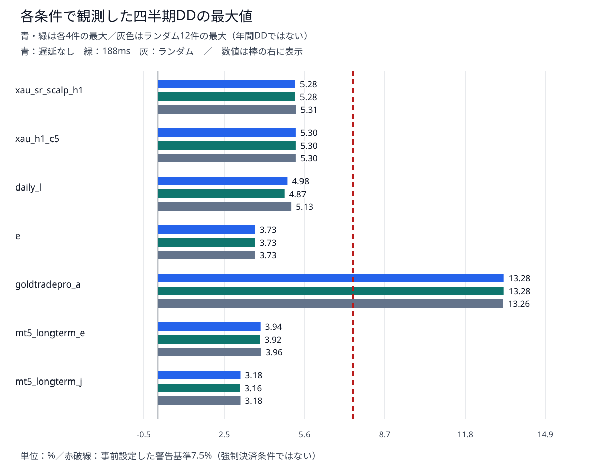

# Ultimate Breakout System Gold 7戦略 — 約定遅延耐性 総合報告書

- 対象：UBS v7.5 demo / XAUUSD用7戦略
- 計算完了：先行40件＋追加100件＝140/140件成功（最終完了2026-09-09 14:32 JST）
- 本書は[先行2戦略の報告書](ubs_execution_delay_comparison.md)を包含した7戦略版である。

## 1. 目的

### 1.1 検証の位置づけ

<span style="color:yellow;">[第1報告書](ubs_gold_strategy_comparison.md)では原setでの収益性・モデル差を、[第2報告書](ubs_same_risk_comparison.md)では固定ロットで最大Equity DDを約5%へ近づけたときの収益性を比較した。本報告書は、その採用ロットで注文の実行が遅れた場合に、損益・DD・取引数・約定系列がどれだけ変わるかを評価する。

第2報告書ではxau_h1_c5を目標DD帯内での収益首位、daily_lを収益と期間安定性のバランス候補と評価した。

### 1.2 変更した設定と比較方法

<span style="color:yellow;">MT5ストラテジーテスター設定タブの「延滞」を変更した。</span>各戦略のset、固定lot、入金額、期間、ティックモデルは前報告書の値を維持した。

| 条件 | ExecutionMode | 各戦略・各WFでの回数 | 全7戦略・4WF |
|---|---:|---:|---:|
| 遅延なし | 0 | 1回 | 28件 |
| 固定188ms | 188 | 1回 | 28件 |
| ランダム遅延 | -1 | 3回（R1・R2・R3） | 84件 |
| 合計 | — | 5回 | 140件 |

R1～R3は同じ条件での再実行番号であり、別々の固定遅延値ではない。3回の平均と最小～最大でばらつきを見る。ランダムseedは固定しておらず、3回の統計的独立性や確率分布を証明したものではない。

## 2. 結果

### 2.1 総合判断

- eは固定188msの純損益が全WFで一致し、ランダムの変化も小さかった。一方、mt5_longterm_eでは固定188msでもWF4の赤字が拡大し、取引数も変化した。
- <span style="color:yellow;">xau_h1_c5は固定188msの純損益・deal系列が全WFで一致したが、ランダムではWF3の利益が大きく変わった。</span>
- <span style="color:yellow;">daily_lもWF4で大きな変化があり、収益上位だから遅延に無感応とはいえない。</span>
- <span style="color:yellow;">goldtradepro_aはWF4のランダムNPが22.27～102.99 USDと大きくばらついた。</span>さらにNo DelayからDDが13.28%と高く、同一リスク比較の対象としては別扱いが必要である。
- 140件はすべて実行・入力・ティック監査に成功したが、損益が負のケースは4件。正常実行と黒字は別の判定である。遅延あり112件中、deal系列変更は71件、Trades変更は9件だった。
- 遅延で利益が増えたケースもあるが、実運用の利益改善を保証する結果ではない。注文・約定・決済の経路への感応度として読む。

### 2.2 7戦略の参考合計と変化



<span style="color:yellow;">この図は4つのWFの単純合計であり、</span>約1年間の連続バックテストではない。 各WFは3,000 USDから独立開始した。ランダムは各WFの3回平均を計算してから4期分を合計している。ランダムの独立した年間3試行ではない。

| 戦略 | lot | 基準NP合計 | 188ms合計 | 差 | ランダム平均合計 | 差 |
|---|---:|---:|---:|---:|---:|---:|
| xau_sr_scalp_h1 | 0.03 | 430.47 | 429.81 | -0.66 | 439.78 | +9.31 |
| xau_h1_c5 | 0.03 | 1299.75 | 1299.75 | +0.00 | 1393.86 | +94.11 |
| daily_l | 0.04 | 652.99 | 650.99 | -2.00 | 757.51 | +104.52 |
| e | 0.03 | 420.44 | 420.44 | +0.00 | 421.37 | +0.93 |
| goldtradepro_a | 0.01 | 726.48 | 723.18 | -3.30 | 761.02 | +34.54 |
| mt5_longterm_e | 0.01 | 349.14 | 327.96 | -21.18 | 321.60 | -27.54 |
| mt5_longterm_j | 0.02 | 561.91 | 561.91 | +0.00 | 577.59 | +15.68 |

金額はUSD。過去年間DDを目標帯4.5～5.5%に収められたのはxau_sr_scalp_h1、xau_h1_c5、daily_l、eの4戦略。mt5_longterm_e・mt5_longterm_jはロット刻みのため低め、goldtradepro_aは最低lotでも高めである。この3戦略を含む利益額の単純順位は同一リスク順位ではなく、各戦略自身の基準からの変化を中心に評価する。



- 差 = 遅延ありのNet Profit − 遅延なしのNet Profit。正は増加、負は減少。合計で相殺される期間差があるため、次のWF別図も確認する。
- <span style="color:yellow;">ランダム遅延は、Net Profitを増やす？</span>

### 2.3 ランダム遅延のWF別変化



- 各セルは四半期の平均差と3回の実測範囲。利益が増えたことを「耐性が高い」と同一視しない。基準からの変化が大きければ、有利方向でも執行条件への依存を示す。
- <span style="color:yellow;">全区間でランダム遅延の方が儲かるのは、xau_h1_c5、e、mt5_longterm_jの3つ</span>

### 2.4 DDと赤字ケース



図は各戦略の四半期DD最大値。青・緑は各4件、灰はランダム12件の最大を示す。DDを足した値でも年間連続DDでもない。

| 戦略 | 基準DD最大 % | 188ms DD最大 % | ランダムDD最大 % |
|---|---:|---:|---:|
| xau_sr_scalp_h1 | 5.28 | 5.28 | 5.31 |
| xau_h1_c5 | 5.30 | 5.30 | 5.30 |
| daily_l | 4.98 | 4.87 | 5.13 |
| e | 3.73 | 3.73 | 3.73 |
| goldtradepro_a | 13.28 | 13.28 | 13.26 |
| mt5_longterm_e | 3.94 | 3.92 | 3.96 |
| mt5_longterm_j | 3.18 | 3.16 | 3.18 |

<span style="color:yellow;">7.5%超は5件で、すべてgoldtradepro_aのWF4。</span>7.5%は[2026-09-03の決定記録](../decisions/20260903_ubs_same_risk_criterion.md)に事前記載された警告値である。数値選択の詳細根拠は記録されておらず、統計的安全限界・MT5の規定値・強制決済条件ではない。約5%は過去年間DDを調整する目標で、7.5%は結果を分類する別の基準である。

| 赤字ケース | NP USD | Trades | DD % |
|---|---:|---:|---:|
| WF4_mt5_longterm_e_no_delay | -0.02 | 32 | 2.15 |
| WF4_mt5_longterm_e_fixed_188 | -21.76 | 33 | 2.61 |
| WF4_mt5_longterm_e_random_2 | -12.91 | 33 | 2.39 |
| WF4_mt5_longterm_e_random_3 | -20.11 | 33 | 2.66 |

### 2.5 約定系列・取引数の変化

dealは個々の売買約定、deal系列はその日時・方向・約定価格の時系列である。SHA-256が異なる場合、その系列の少なくとも一部が異なる。ハッシュは差の原因や途中のEquity全体を表すものではない。

| 戦略 | 固定188ms系列一致 | ランダム系列一致 | Trades変更件数（遅延あり16件中） |
|---|---:|---:|---:|
| xau_sr_scalp_h1 | 2/4 | 1/12 | 0 |
| xau_h1_c5 | 4/4 | 5/12 | 0 |
| daily_l | 1/4 | 0/12 | 0 |
| e | 4/4 | 10/12 | 0 |
| goldtradepro_a | 0/4 | 0/12 | 0 |
| mt5_longterm_e | 1/4 | 0/12 | 6 |
| mt5_longterm_j | 4/4 | 9/12 | 3 |

- 例えばxau_h1_c5のWF3固定188msはNP・deal系列が同じでもDDが2.14%から2.16%へ変わった。約定系列だけでは、保有中の評価損益や注文変更の全履歴まで同一とは確認できない。
- <span style="color:yellow;">xau_h1_c5、e、mt5_longterm_jは、遅延なしと固定遅延の間で約定が一致する。</span>

### 2.6 戦略ごとの読み方

| 戦略 | 今回の評価 |
|---|---|
| xau_sr_scalp_h1 | 188msのNP変化は小さいが、ランダムでWF3・WF4が変化する。 |
| <span style="color:yellow;">xau_h1_c5</span> | 188msのNP・系列は安定。ランダムWF3の大きな利益増加は感応度として扱う。 |
| <span style="color:yellow;">daily_l</span> | 188msのNP減少は小さい。ランダムではWF1・WF2の減益とWF4の大幅増益が混在。 |
| e | 今回の損益感応度は小さい。取引系列・DDが完全不変という意味ではない。 |
| goldtradepro_a | WF4の高DDとランダム損益の大きなばらつきを併せて考慮する。 |
| mt5_longterm_e | WF3のランダム減益、WF4の188ms赤字拡大、取引数変化に注意。 |
| mt5_longterm_j | 多くの期間でNP・系列が一致するが、WF2ランダムでは取引が1件増加する。 |

## 3. 詳細

### 3.1 条件と期間

| 項目 | 条件 |
|---|---|
| EA / Tester | Ultimate Breakout System v7.5 demo / MT5 build 6182（実行ログ） |
| 銘柄・時間足 | XAUUSD・H1。内部時間足は元の設定を維持 |
| モデル | Every tick based on real ticks |
| 初期入金・通貨・レバレッジ | 3,000 USD・USD・1:500 |
| lot方式 | Risk=0、AdjustLotsizeToVariableValues=false、StartLots=MaxLots=選択lot |
| 計算数 | 7戦略×4WF×5回＝140件（各戦略20件） |
| 負荷制限 | BelowNormal、4論理CPU、直列実行 |

**使用ロット一覧（第2報告書から引き継ぎ）**

今回の全140件には、第2報告書で選定した以下の固定ロットを使用した。各戦略でWF1～WF4・遅延なし・188ms・ランダムのすべてに同じロットを適用し、遅延条件ごとにDDが約5%になるよう再調整していない。

| 戦略 | 使用固定ロット | 第2報告書の年間Equity DD | 第2報告書での選定結果 |
|---|---:|---:|---|
| xau_sr_scalp_h1 | 0.03 lot | 4.90% | 目標帯内 |
| xau_h1_c5 | 0.03 lot | 5.29% | 目標帯内 |
| daily_l | 0.04 lot | 4.75% | 目標帯内 |
| e | 0.03 lot | 4.88% | 目標帯内 |
| goldtradepro_a | 0.01 lot | 10.86% | 最低ロットでも目標上限超過 |
| mt5_longterm_e | 0.01 lot | 3.84% | ロット刻みにより目標帯の下側を採用 |
| mt5_longterm_j | 0.02 lot | 3.89% | ロット刻みにより目標帯の下側を採用 |

目標帯は年間DD 4.5～5.5%。この表のDDはロット選定に使った第2報告書の年間テスト値であり、今回の四半期別・遅延ありのDDではない。出典：[第2報告書 2.2](ubs_same_risk_comparison.md#22-約1年ddの調整結果)。

| WF | 従来と同じ指定期間 |
|---|---|
| WF1 | 2025-07-01～2025-09-30 |
| WF2 | 2025-10-01～2025-12-31 |
| WF3 | 2026-01-01～2026-03-31 |
| WF4 | 2026-04-01～2026-06-30 |

実際のINIのToDateは指定末日の00:00である。例えばWF1は2025.07.01 00:00から2025.09.30 00:00までで、9月30日終日を含む意味ではない。全期間はロット選定の過去約1年と重複している。

### 3.2 四半期別NPの比較表

| 戦略 | WF | 基準 | 188ms | R1 | R2 | R3 | ランダム平均 |
|---|---|---:|---:|---:|---:|---:|---:|
| xau_sr_scalp_h1 | WF1 | 6.90 | 6.90 | 6.90 | 4.86 | 5.58 | 5.78 |
| xau_sr_scalp_h1 | WF2 | 203.97 | 203.34 | 201.39 | 203.34 | 205.95 | 203.56 |
| xau_sr_scalp_h1 | WF3 | 103.74 | 103.74 | 99.15 | 118.92 | 100.29 | 106.12 |
| xau_sr_scalp_h1 | WF4 | 115.86 | 115.83 | 124.17 | 131.16 | 117.63 | 124.32 |
| xau_h1_c5 | WF1 | 5.53 | 5.53 | 5.65 | 5.53 | 5.53 | 5.57 |
| xau_h1_c5 | WF2 | 385.19 | 385.19 | 385.19 | 385.19 | 385.19 | 385.19 |
| xau_h1_c5 | WF3 | 662.28 | 662.28 | 720.09 | 774.18 | 774.00 | 756.09 |
| xau_h1_c5 | WF4 | 246.75 | 246.75 | 246.75 | 247.14 | 247.14 | 247.01 |
| daily_l | WF1 | 116.40 | 115.44 | 111.44 | 113.28 | 112.76 | 112.49 |
| daily_l | WF2 | 256.87 | 256.63 | 244.79 | 244.79 | 242.07 | 243.88 |
| daily_l | WF3 | 110.64 | 110.64 | 104.36 | 118.28 | 119.64 | 114.09 |
| daily_l | WF4 | 169.08 | 168.28 | 284.20 | 285.56 | 291.36 | 287.04 |
| e | WF1 | 79.17 | 79.17 | 79.38 | 81.75 | 79.17 | 80.10 |
| e | WF2 | 82.73 | 82.73 | 82.73 | 82.73 | 82.73 | 82.73 |
| e | WF3 | 171.06 | 171.06 | 171.06 | 171.06 | 171.06 | 171.06 |
| e | WF4 | 87.48 | 87.48 | 87.48 | 87.48 | 87.48 | 87.48 |
| goldtradepro_a | WF1 | 138.83 | 138.79 | 137.01 | 136.56 | 136.02 | 136.53 |
| goldtradepro_a | WF2 | 140.61 | 140.22 | 138.68 | 140.25 | 141.48 | 140.14 |
| goldtradepro_a | WF3 | 416.17 | 416.61 | 407.30 | 419.99 | 398.57 | 408.62 |
| goldtradepro_a | WF4 | 30.87 | 27.56 | 102.99 | 22.27 | 101.94 | 75.73 |
| mt5_longterm_e | WF1 | 77.62 | 77.71 | 77.51 | 84.54 | 77.71 | 79.92 |
| mt5_longterm_e | WF2 | 50.07 | 50.54 | 54.37 | 54.58 | 53.75 | 54.23 |
| mt5_longterm_e | WF3 | 221.47 | 221.47 | 193.00 | 193.81 | 206.79 | 197.87 |
| mt5_longterm_e | WF4 | -0.02 | -21.76 | 1.76 | -12.91 | -20.11 | -10.42 |
| mt5_longterm_j | WF1 | 188.95 | 188.95 | 188.95 | 188.95 | 188.95 | 188.95 |
| mt5_longterm_j | WF2 | 3.10 | 3.10 | 18.78 | 18.78 | 18.78 | 18.78 |
| mt5_longterm_j | WF3 | 188.14 | 188.14 | 188.14 | 188.14 | 188.14 | 188.14 |
| mt5_longterm_j | WF4 | 181.72 | 181.72 | 181.72 | 181.72 | 181.72 | 181.72 |

単位：USD。R1～R3は同一条件のランダム反復。

### 3.3 再現性・データ品質・限界

- 2runの条件、EA SHA-256、前段階の基準manifest SHA-256が一致。全140件のresultハッシュ、HTMLの損益とdeal監査、入力setハッシュ、固定entry lotを再確認した。
- 遅延なし28件は前段階のTrades・deal系列一致、NP差max(0.10 USD, 基準の0.5%)以内、DD差0.01pp以内の再現ゲートを通過した。
- 全件の入力互換性・ティック監査がPASS。WF1は既知の24分の実ティック欠損を補完しており、既存の比率上限0.03%・絶対数24分以下を適用した。7戦略分の異なる欠損が累積した意味ではない。
- 遅延ありのreproduction_passed=falseは基準との不一致を示す。実行失敗とは区別する。
- Commission・Swap・各deal Profit合計とdeal系列SHA-256は各result.json、個別約定はHTMLに保存されている。個々の損益差の発生原因まで本書で断定していない。
- ランダム3回は初期評価である。範囲は実測最小～最大で、信頼区間や将来の最大損失幅ではない。
- 実取引でのスリッページ測定、スプレッド加工、追加手数料、低資金、同時稼働ポートフォリオは今回の検証範囲外。
- 正確な最適化期間が不明なため、厳密な未知期間の成績とは断定しない。

### 3.4 全140件の指標

NP=純損益USD、PF=Profit Factor、RF=Recovery Factor、DD=最大Equity DD%。期間別のPF・RF・Sharpeを合計・平均して年間値としていない。

#### xau_sr_scalp_h1

| WF | 遅延 | NP | Trades | PF | RF | Sharpe | DD % |
|---|---|---:|---:|---:|---:|---:|---:|
| WF1 | なし | 6.90 | 36 | 1.03 | 0.07 | 3.01 | 3.08 |
| WF1 | 188ms | 6.90 | 36 | 1.03 | 0.07 | 3.01 | 3.08 |
| WF1 | R1 | 6.90 | 36 | 1.03 | 0.07 | 3.01 | 3.13 |
| WF1 | R2 | 4.86 | 36 | 1.02 | 0.05 | 2.11 | 3.21 |
| WF1 | R3 | 5.58 | 36 | 1.03 | 0.06 | 2.43 | 3.17 |
| WF2 | なし | 203.97 | 32 | 2.08 | 3.60 | 98.84 | 1.88 |
| WF2 | 188ms | 203.34 | 32 | 2.08 | 3.69 | 98.21 | 1.83 |
| WF2 | R1 | 201.39 | 32 | 2.04 | 3.94 | 97.39 | 1.59 |
| WF2 | R2 | 203.34 | 32 | 2.06 | 3.63 | 98.50 | 1.86 |
| WF2 | R3 | 205.95 | 32 | 2.09 | 4.03 | 99.89 | 1.60 |
| WF3 | なし | 103.74 | 27 | 1.39 | 0.64 | 41.46 | 5.28 |
| WF3 | 188ms | 103.74 | 27 | 1.39 | 0.64 | 41.46 | 5.28 |
| WF3 | R1 | 99.15 | 27 | 1.37 | 0.61 | 39.44 | 5.31 |
| WF3 | R2 | 118.92 | 27 | 1.45 | 0.73 | 47.08 | 5.30 |
| WF3 | R3 | 100.29 | 27 | 1.38 | 0.67 | 40.42 | 4.86 |
| WF4 | なし | 115.86 | 36 | 1.46 | 1.05 | 59.22 | 3.68 |
| WF4 | 188ms | 115.83 | 36 | 1.46 | 1.05 | 58.93 | 3.65 |
| WF4 | R1 | 124.17 | 36 | 1.49 | 1.14 | 61.28 | 3.61 |
| WF4 | R2 | 131.16 | 36 | 1.52 | 1.16 | 64.82 | 3.75 |
| WF4 | R3 | 117.63 | 36 | 1.46 | 1.06 | 57.53 | 3.67 |

#### xau_h1_c5

| WF | 遅延 | NP | Trades | PF | RF | Sharpe | DD % |
|---|---|---:|---:|---:|---:|---:|---:|
| WF1 | なし | 5.53 | 29 | 1.03 | 0.05 | 0.53 | 3.51 |
| WF1 | 188ms | 5.53 | 29 | 1.03 | 0.05 | 0.53 | 3.51 |
| WF1 | R1 | 5.65 | 29 | 1.04 | 0.05 | 0.54 | 3.51 |
| WF1 | R2 | 5.53 | 29 | 1.03 | 0.05 | 0.53 | 3.51 |
| WF1 | R3 | 5.53 | 29 | 1.03 | 0.05 | 0.53 | 3.51 |
| WF2 | なし | 385.19 | 26 | 2.43 | 2.22 | 55.25 | 5.30 |
| WF2 | 188ms | 385.19 | 26 | 2.43 | 2.22 | 55.25 | 5.30 |
| WF2 | R1 | 385.19 | 26 | 2.43 | 2.22 | 55.25 | 5.30 |
| WF2 | R2 | 385.19 | 26 | 2.43 | 2.22 | 55.25 | 5.30 |
| WF2 | R3 | 385.19 | 26 | 2.43 | 2.22 | 55.25 | 5.30 |
| WF3 | なし | 662.28 | 24 | 6.55 | 9.30 | 80.35 | 2.14 |
| WF3 | 188ms | 662.28 | 24 | 6.55 | 9.21 | 80.35 | 2.16 |
| WF3 | R1 | 720.09 | 24 | 7.05 | 10.09 | 87.41 | 2.11 |
| WF3 | R2 | 774.18 | 24 | 7.50 | 10.58 | 93.48 | 2.13 |
| WF3 | R3 | 774.00 | 24 | 7.50 | 10.49 | 93.45 | 2.15 |
| WF4 | なし | 246.75 | 30 | 2.16 | 1.86 | 35.55 | 4.21 |
| WF4 | 188ms | 246.75 | 30 | 2.16 | 1.86 | 35.55 | 4.21 |
| WF4 | R1 | 246.75 | 30 | 2.16 | 1.86 | 35.14 | 4.21 |
| WF4 | R2 | 247.14 | 30 | 2.17 | 1.85 | 35.20 | 4.24 |
| WF4 | R3 | 247.14 | 30 | 2.17 | 1.86 | 35.61 | 4.21 |

#### daily_l

| WF | 遅延 | NP | Trades | PF | RF | Sharpe | DD % |
|---|---|---:|---:|---:|---:|---:|---:|
| WF1 | なし | 116.40 | 11 | 1.77 | 0.78 | 1.54 | 4.65 |
| WF1 | 188ms | 115.44 | 11 | 1.76 | 0.78 | 1.53 | 4.65 |
| WF1 | R1 | 111.44 | 11 | 1.73 | 0.74 | 1.47 | 4.69 |
| WF1 | R2 | 113.28 | 11 | 1.74 | 0.76 | 1.49 | 4.65 |
| WF1 | R3 | 112.76 | 11 | 1.74 | 0.76 | 1.49 | 4.65 |
| WF2 | なし | 256.87 | 8 | 4.30 | 3.16 | 3.62 | 2.62 |
| WF2 | 188ms | 256.63 | 8 | 4.30 | 3.18 | 3.62 | 2.61 |
| WF2 | R1 | 244.79 | 8 | 4.15 | 3.04 | 3.44 | 2.61 |
| WF2 | R2 | 244.79 | 8 | 4.15 | 3.05 | 3.44 | 2.61 |
| WF2 | R3 | 242.07 | 8 | 4.10 | 2.91 | 3.38 | 2.70 |
| WF3 | なし | 110.64 | 15 | 1.27 | 0.71 | 9.42 | 4.98 |
| WF3 | 188ms | 110.64 | 15 | 1.27 | 0.73 | 9.42 | 4.87 |
| WF3 | R1 | 104.36 | 15 | 1.25 | 0.65 | 8.88 | 5.13 |
| WF3 | R2 | 118.28 | 15 | 1.29 | 0.85 | 10.12 | 4.39 |
| WF3 | R3 | 119.64 | 15 | 1.30 | 0.80 | 10.24 | 4.69 |
| WF4 | なし | 169.08 | 13 | 2.50 | 1.26 | 10.23 | 4.35 |
| WF4 | 188ms | 168.28 | 13 | 2.48 | 1.26 | 10.18 | 4.34 |
| WF4 | R1 | 284.20 | 13 | 3.69 | 3.16 | 15.11 | 2.87 |
| WF4 | R2 | 285.56 | 13 | 3.73 | 3.21 | 15.17 | 2.83 |
| WF4 | R3 | 291.36 | 13 | 3.79 | 3.28 | 15.47 | 2.83 |

#### e

| WF | 遅延 | NP | Trades | PF | RF | Sharpe | DD % |
|---|---|---:|---:|---:|---:|---:|---:|
| WF1 | なし | 79.17 | 18 | 1.49 | 0.92 | 3.40 | 2.83 |
| WF1 | 188ms | 79.17 | 18 | 1.49 | 0.91 | 3.40 | 2.87 |
| WF1 | R1 | 79.38 | 18 | 1.49 | 0.87 | 3.41 | 2.99 |
| WF1 | R2 | 81.75 | 18 | 1.51 | 0.92 | 3.53 | 2.90 |
| WF1 | R3 | 79.17 | 18 | 1.49 | 0.88 | 3.40 | 2.94 |
| WF2 | なし | 82.73 | 9 | 1.83 | 1.44 | 3.53 | 1.91 |
| WF2 | 188ms | 82.73 | 9 | 1.83 | 1.44 | 3.53 | 1.91 |
| WF2 | R1 | 82.73 | 9 | 1.83 | 1.44 | 3.53 | 1.91 |
| WF2 | R2 | 82.73 | 9 | 1.83 | 1.44 | 3.53 | 1.91 |
| WF2 | R3 | 82.73 | 9 | 1.83 | 1.44 | 3.53 | 1.91 |
| WF3 | なし | 171.06 | 12 | 1.97 | 1.39 | 13.28 | 3.73 |
| WF3 | 188ms | 171.06 | 12 | 1.97 | 1.39 | 13.28 | 3.73 |
| WF3 | R1 | 171.06 | 12 | 1.97 | 1.39 | 13.28 | 3.73 |
| WF3 | R2 | 171.06 | 12 | 1.97 | 1.39 | 13.28 | 3.73 |
| WF3 | R3 | 171.06 | 12 | 1.97 | 1.39 | 13.28 | 3.73 |
| WF4 | なし | 87.48 | 18 | 1.46 | 0.97 | 8.98 | 2.96 |
| WF4 | 188ms | 87.48 | 18 | 1.46 | 0.96 | 8.98 | 2.98 |
| WF4 | R1 | 87.48 | 18 | 1.46 | 0.98 | 8.98 | 2.93 |
| WF4 | R2 | 87.48 | 18 | 1.46 | 0.98 | 8.98 | 2.93 |
| WF4 | R3 | 87.48 | 18 | 1.46 | 0.97 | 8.98 | 2.96 |

#### goldtradepro_a

| WF | 遅延 | NP | Trades | PF | RF | Sharpe | DD % |
|---|---|---:|---:|---:|---:|---:|---:|
| WF1 | なし | 138.83 | 17 | 5.20 | 2.11 | 6.39 | 2.14 |
| WF1 | 188ms | 138.79 | 17 | 5.13 | 2.11 | 6.38 | 2.14 |
| WF1 | R1 | 137.01 | 17 | 4.94 | 2.10 | 6.30 | 2.13 |
| WF1 | R2 | 136.56 | 17 | 4.83 | 2.09 | 6.12 | 2.13 |
| WF1 | R3 | 136.02 | 17 | 4.87 | 2.09 | 6.26 | 2.12 |
| WF2 | なし | 140.61 | 8 | 4.51 | 2.48 | 1.29 | 1.88 |
| WF2 | 188ms | 140.22 | 8 | 4.47 | 2.46 | 1.29 | 1.88 |
| WF2 | R1 | 138.68 | 8 | 4.30 | 2.39 | 1.27 | 1.88 |
| WF2 | R2 | 140.25 | 8 | 4.39 | 2.44 | 1.29 | 1.85 |
| WF2 | R3 | 141.48 | 8 | 4.49 | 2.48 | 1.30 | 1.83 |
| WF3 | なし | 416.17 | 12 | 20.41 | 2.18 | 7.82 | 5.54 |
| WF3 | 188ms | 416.61 | 12 | 20.01 | 2.18 | 7.83 | 5.55 |
| WF3 | R1 | 407.30 | 12 | 13.26 | 2.07 | 7.62 | 5.73 |
| WF3 | R2 | 419.99 | 12 | 16.63 | 2.16 | 7.89 | 5.66 |
| WF3 | R3 | 398.57 | 12 | 11.21 | 2.06 | 7.42 | 5.65 |
| WF4 | なし | 30.87 | 17 | 1.12 | 0.07 | 0.30 | 13.28 |
| WF4 | 188ms | 27.56 | 17 | 1.10 | 0.07 | 0.26 | 13.28 |
| WF4 | R1 | 102.99 | 17 | 1.39 | 0.25 | 0.96 | 13.24 |
| WF4 | R2 | 22.27 | 17 | 1.08 | 0.05 | 0.21 | 13.26 |
| WF4 | R3 | 101.94 | 17 | 1.38 | 0.24 | 0.95 | 13.25 |

#### mt5_longterm_e

| WF | 遅延 | NP | Trades | PF | RF | Sharpe | DD % |
|---|---|---:|---:|---:|---:|---:|---:|
| WF1 | なし | 77.62 | 45 | 2.28 | 2.10 | 28.42 | 1.23 |
| WF1 | 188ms | 77.71 | 45 | 2.29 | 2.10 | 28.46 | 1.23 |
| WF1 | R1 | 77.51 | 44 | 2.30 | 2.09 | 28.53 | 1.23 |
| WF1 | R2 | 84.54 | 45 | 2.40 | 2.28 | 30.61 | 1.23 |
| WF1 | R3 | 77.71 | 45 | 2.29 | 2.07 | 28.46 | 1.25 |
| WF2 | なし | 50.07 | 41 | 1.28 | 0.42 | 18.69 | 3.94 |
| WF2 | 188ms | 50.54 | 41 | 1.29 | 0.43 | 18.84 | 3.92 |
| WF2 | R1 | 54.37 | 41 | 1.31 | 0.46 | 20.28 | 3.96 |
| WF2 | R2 | 54.58 | 41 | 1.31 | 0.46 | 20.10 | 3.95 |
| WF2 | R3 | 53.75 | 41 | 1.31 | 0.47 | 19.87 | 3.81 |
| WF3 | なし | 221.47 | 37 | 9.31 | 12.82 | 146.93 | 0.54 |
| WF3 | 188ms | 221.47 | 37 | 9.31 | 12.55 | 146.93 | 0.55 |
| WF3 | R1 | 193.00 | 36 | 5.00 | 6.29 | 121.93 | 0.97 |
| WF3 | R2 | 193.81 | 36 | 5.02 | 6.32 | 122.07 | 0.97 |
| WF3 | R3 | 206.79 | 37 | 5.23 | 6.71 | 129.33 | 0.97 |
| WF4 | なし | -0.02 | 32 | 1.00 | 0.00 | -0.01 | 2.15 |
| WF4 | 188ms | -21.76 | 33 | 0.84 | -0.28 | -5.00 | 2.61 |
| WF4 | R1 | 1.76 | 32 | 1.02 | 0.03 | 0.96 | 2.15 |
| WF4 | R2 | -12.91 | 33 | 0.90 | -0.18 | -5.00 | 2.39 |
| WF4 | R3 | -20.11 | 33 | 0.85 | -0.25 | -5.00 | 2.66 |

#### mt5_longterm_j

| WF | 遅延 | NP | Trades | PF | RF | Sharpe | DD % |
|---|---|---:|---:|---:|---:|---:|---:|
| WF1 | なし | 188.95 | 31 | 2.10 | 2.71 | 14.20 | 2.27 |
| WF1 | 188ms | 188.95 | 31 | 2.10 | 2.71 | 14.20 | 2.27 |
| WF1 | R1 | 188.95 | 31 | 2.10 | 2.70 | 14.20 | 2.27 |
| WF1 | R2 | 188.95 | 31 | 2.10 | 2.70 | 14.20 | 2.27 |
| WF1 | R3 | 188.95 | 31 | 2.10 | 2.66 | 14.20 | 2.30 |
| WF2 | なし | 3.10 | 20 | 1.01 | 0.03 | 0.67 | 3.18 |
| WF2 | 188ms | 3.10 | 20 | 1.01 | 0.03 | 0.67 | 3.16 |
| WF2 | R1 | 18.78 | 21 | 1.08 | 0.19 | 4.21 | 3.16 |
| WF2 | R2 | 18.78 | 21 | 1.08 | 0.19 | 4.21 | 3.18 |
| WF2 | R3 | 18.78 | 21 | 1.08 | 0.19 | 4.21 | 3.16 |
| WF3 | なし | 188.14 | 16 | 3.86 | 3.07 | 83.80 | 1.92 |
| WF3 | 188ms | 188.14 | 16 | 3.86 | 3.07 | 83.80 | 1.92 |
| WF3 | R1 | 188.14 | 16 | 3.86 | 3.07 | 83.80 | 1.92 |
| WF3 | R2 | 188.14 | 16 | 3.86 | 3.07 | 83.80 | 1.92 |
| WF3 | R3 | 188.14 | 16 | 3.86 | 3.06 | 83.80 | 1.93 |
| WF4 | なし | 181.72 | 23 | 2.31 | 2.78 | 35.59 | 2.12 |
| WF4 | 188ms | 181.72 | 23 | 2.31 | 2.78 | 35.59 | 2.12 |
| WF4 | R1 | 181.72 | 23 | 2.31 | 2.85 | 35.59 | 2.07 |
| WF4 | R2 | 181.72 | 23 | 2.31 | 2.78 | 35.59 | 2.12 |
| WF4 | R3 | 181.72 | 23 | 2.31 | 2.90 | 35.59 | 2.03 |

### 3.5 保存先・履歴・再生成

- 先行2戦略40件：`data/ubs_strategy_comparison/execution_delay/20260907T111206507930_693c20ee`
- 追加5戦略100件：`data/ubs_strategy_comparison/execution_delay/20260909T093437057969_12b0fa2c`
- 各runのrun_manifest.jsonから各ケースのresult.json、HTML、INI、input_set.set、ログへ追跡できる。
- 累積集計CSVは先行runのWF4_daily_l_random_3、追加runのWF4_mt5_longterm_j_random_3に保存。
- 先行の更新前build 6140の中断runは集計から除外した。追加runは利用者指示でケース間停止・再開し、プロセス確認タイムアウト後も確定済み結果を再利用した。
- 生データはdata以下でGit管理外。本書と4枚のSVGはdoc/reports以下。
- 本書の作成ではMT5の再計算は行っていない。

```powershell
uv run python -m mt5_ea_validator.ubs_all_delay_report --first-run data/ubs_strategy_comparison/execution_delay/20260907T111206507930_693c20ee --remaining-run data/ubs_strategy_comparison/execution_delay/20260909T093437057969_12b0fa2c --output doc/reports/ubs_execution_delay_all_strategies_new.md
```

既存の出力を保護するため、再生成時は未使用のファイル名を指定する。
