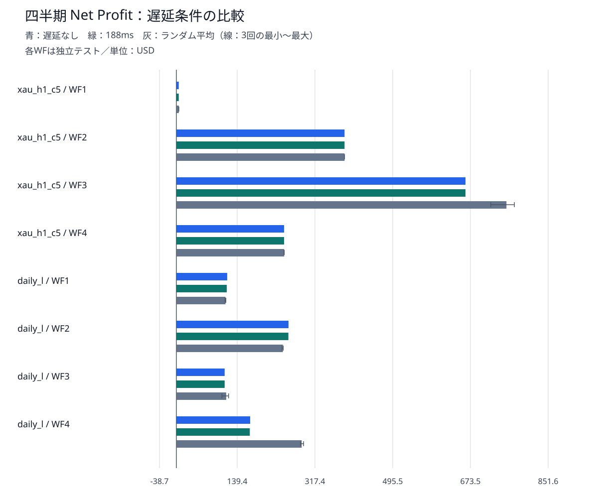
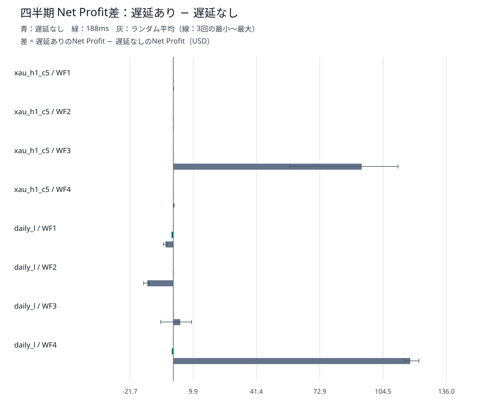
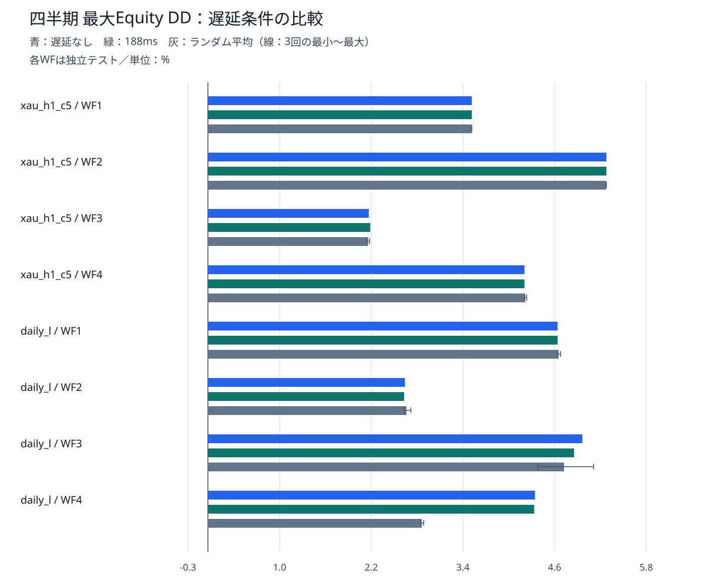

# Ultimate Breakout System — 約定遅延耐性 総合報告書

- 対象：UBS v7.5 demo / XAUUSD / xau_h1_c5・daily_l
- 実行結果：40/40正常完了（2026-09-07 12:02 JST）

## 1. 目的

<span style="color:yellow;">前段階の[原set比較](ubs_gold_strategy_comparison.md)と[同一リスク比較](ubs_same_risk_comparison.md)で選んだ2戦略（xau_h1_c5とdaily_l）について、注文実行の遅れに対する成績の感応度を確認する。</span>第2報告書で採用した固定ロットと期間を維持し、MT5のExecutionModeだけを変更した。7戦略全体の検証ではない。

<span style="color:yellow;">遅延なしを基準に固定188msとランダム遅延3回を比較する。</span>評価対象は損益だけでなく、含み損を含む最大Equity DD、取引数、約定系列である。実取引でのスリッページ実測や、スプレッドを加工するコストストレスは今回実施していない。

## 2. 結論

### 2.1 総合判断

- <span style="color:yellow;">固定188msの影響は今回の範囲では小さい。</span>xau_h1_c5は4期ともNet Profitとdeal系列が一致した。daily_lの4期合計NPは652.99 USDから650.99 USDへ2.00 USD（約0.31%）減少した。
- <span style="color:yellow;">ランダム遅延には感応度がある。</span>xau_h1_c5のWF3はNPが+57.81～+111.90 USD変化し、daily_lのWF4は+115.12～+122.28 USD変化した。一方、daily_lのWF1・WF2では利益が減少した。
- <span style="color:yellow;">全40件で黒字、全遅延ケースでTradesは対応する基準と同数だった。</span>それでも日時・方向・約定価格から作るdeal系列は32遅延ケース中22件で異なった。取引数の一致だけでは再現性を判断できない。
- <span style="color:yellow;">最大Equity DDは全ケースで7.5%警告線未満。</span>これは過去の今回条件の結果であり、将来の損失上限や強制決済機能ではない。
- 遅延で利益が増えたことを、実運用で期待できる改善とは判断しない。執行時点や注文管理の変化に成績が左右される結果として扱う。ランダムは3回の初期評価であり、十分な確率分布の推定ではない。

### 2.2 四半期ごとのNet Profit



線はランダム3回の最小～最大、灰色の棒は平均。信頼区間ではない。各棒は四半期1回のテストを表し、4つのWFの総和ではない。

| 戦略 | WF | 遅延なし NP | 188ms NP | ランダム平均 NP | ランダム最小～最大 NP |
|---|---|---:|---:|---:|---:|
| xau_h1_c5 | WF1 | 5.53 | 5.53 | 5.57 | 5.53～5.65 |
| xau_h1_c5 | WF2 | 385.19 | 385.19 | 385.19 | 385.19～385.19 |
| xau_h1_c5 | WF3 | 662.28 | 662.28 | 756.09 | 720.09～774.18 |
| xau_h1_c5 | WF4 | 246.75 | 246.75 | 247.01 | 246.75～247.14 |
| daily_l | WF1 | 116.40 | 115.44 | 112.49 | 111.44～113.28 |
| daily_l | WF2 | 256.87 | 256.63 | 243.88 | 242.07～244.79 |
| daily_l | WF3 | 110.64 | 110.64 | 114.09 | 104.36～119.64 |
| daily_l | WF4 | 169.08 | 168.28 | 287.04 | 284.20～291.36 |

金額の単位はUSD。四半期は毎回3,000 USDから独立して開始している。4期の単純合計は資金を引き継ぐ年間連続運用の成績ではない。

### 2.3 遅延による損益差



差 = 遅延ありのNet Profit − 遅延なしのNet Profit。右側（正）は利益増加、左側（負）は利益減少。ゼロ近傍は損益変化が小さいことを意味するが、約定系列や途中のDDまで同じとは限らない。

### 2.4 Equity DD



DDは決済済み損益だけでなく、保有中の含み損益にも依存する。例えばxau_h1_c5のWF3固定188msはNP・deal系列が同じでもDDが2.14%から2.16%へ変わった。daily_lのWF3もNP・deal系列が同じでDDは4.98%から4.87%へ変わった。ハッシュが同じでも、途中のEquity経路全体が同一とは限らない。

## 3. 詳細

### 3.1 条件・期間・計算数

| 項目 | 条件 |
|---|---|
| EA | Ultimate Breakout System v7.5 demo |
| MT5 | 更新後build 6182で新runを実行 |
| 銘柄・Tester時間足 | XAUUSD・H1（内部時間足設定はsetを維持） |
| モデル | Every tick based on real ticks |
| Deposit・通貨・レバレッジ | 3000 USD・USD・1:500 |
| 固定ロット | xau_h1_c5：0.03 / daily_l：0.04 |
| 資金管理 | Risk=0、AdjustLotsizeToVariableValues=false、StartLots=MaxLots=採用lot |
| 遅延 | ExecutionMode=0、188、-1（ランダム3回） |
| 計算数 | 2戦略 × 4WF × (基準1 + 固定1 + ランダム3) = 40件 |
| 実行負荷 | BelowNormal・4論理CPU・直列実行 |

| WF | 期間（従来と同じ） |
|---|---|
| WF1 | 2025-07-01～2025-09-30 |
| WF2 | 2025-10-01～2025-12-31 |
| WF3 | 2026-01-01～2026-03-31 |
| WF4 | 2026-04-01～2026-06-30 |

期間表は従来の指定日表記。実際のTester FromDate/ToDateは各INIに保存され、ToDateは末日の00:00境界である。例えばWF1は2025.07.01 00:00から2025.09.30 00:00までであり、9月30日終日を含むという意味ではない。ロット選定に使った約1年とWFは重複するため、独立した未知期間の検証とは扱わない。

### 3.2 約定系列と監査

dealは個々の売買約定、deal系列は日時・方向・約定価格の時系列である。そのSHA-256を対応する遅延なしと比較した。ハッシュ自体は取引詳細を表示せず、違いの有無を検出する。個別の差の原因を確定するにはHTMLの約定行・注文・ログの追跡が必要になる。

| 戦略 | 固定188ms系列一致 | ランダム系列一致 | 遅延ケースのTrades一致 |
|---|---:|---:|---:|
| xau_h1_c5 | 4/4 | 5/12 | 16/16 |
| daily_l | 1/4 | 0/12 | 16/16 |

8件のNo Delayは前段階に対する再現ゲートを通過。40件すべてで入力互換性とティック品質がPASS。WF1には従来と同じ24分の実ティック欠損補完があり、比率上限0.03%・絶対数24分以下の既存条件を適用した。

保存JSONのreproduction_passedは厳密な基準との再現判定である。遅延ありでfalseになること自体は失敗ではない。遅延ありで取引やDDが変わることが今回の測定対象である。

### 3.3 全40件の実測値

NP：純損益（USD）、PF：Profit Factor、RF：Recovery Factor、DD：最大Equity DD（%）。R1～R3はランダム遅延の反復番号であり、別の遅延設定値ではない。

| 戦略 | WF | 遅延 | NP | Trades | PF | RF | Sharpe | DD % |
|---|---|---|---:|---:|---:|---:|---:|---:|
| xau_h1_c5 | WF1 | なし | 5.53 | 29 | 1.03 | 0.05 | 0.53 | 3.51 |
| xau_h1_c5 | WF1 | 188ms | 5.53 | 29 | 1.03 | 0.05 | 0.53 | 3.51 |
| xau_h1_c5 | WF1 | R1 | 5.65 | 29 | 1.04 | 0.05 | 0.54 | 3.51 |
| xau_h1_c5 | WF1 | R2 | 5.53 | 29 | 1.03 | 0.05 | 0.53 | 3.51 |
| xau_h1_c5 | WF1 | R3 | 5.53 | 29 | 1.03 | 0.05 | 0.53 | 3.51 |
| daily_l | WF1 | なし | 116.40 | 11 | 1.77 | 0.78 | 1.54 | 4.65 |
| daily_l | WF1 | 188ms | 115.44 | 11 | 1.76 | 0.78 | 1.53 | 4.65 |
| daily_l | WF1 | R1 | 111.44 | 11 | 1.73 | 0.74 | 1.47 | 4.69 |
| daily_l | WF1 | R2 | 113.28 | 11 | 1.74 | 0.76 | 1.49 | 4.65 |
| daily_l | WF1 | R3 | 112.76 | 11 | 1.74 | 0.76 | 1.49 | 4.65 |
| xau_h1_c5 | WF2 | なし | 385.19 | 26 | 2.43 | 2.22 | 55.25 | 5.30 |
| xau_h1_c5 | WF2 | 188ms | 385.19 | 26 | 2.43 | 2.22 | 55.25 | 5.30 |
| xau_h1_c5 | WF2 | R1 | 385.19 | 26 | 2.43 | 2.22 | 55.25 | 5.30 |
| xau_h1_c5 | WF2 | R2 | 385.19 | 26 | 2.43 | 2.22 | 55.25 | 5.30 |
| xau_h1_c5 | WF2 | R3 | 385.19 | 26 | 2.43 | 2.22 | 55.25 | 5.30 |
| daily_l | WF2 | なし | 256.87 | 8 | 4.30 | 3.16 | 3.62 | 2.62 |
| daily_l | WF2 | 188ms | 256.63 | 8 | 4.30 | 3.18 | 3.62 | 2.61 |
| daily_l | WF2 | R1 | 244.79 | 8 | 4.15 | 3.04 | 3.44 | 2.61 |
| daily_l | WF2 | R2 | 244.79 | 8 | 4.15 | 3.05 | 3.44 | 2.61 |
| daily_l | WF2 | R3 | 242.07 | 8 | 4.10 | 2.91 | 3.38 | 2.70 |
| xau_h1_c5 | WF3 | なし | 662.28 | 24 | 6.55 | 9.30 | 80.35 | 2.14 |
| xau_h1_c5 | WF3 | 188ms | 662.28 | 24 | 6.55 | 9.21 | 80.35 | 2.16 |
| xau_h1_c5 | WF3 | R1 | 720.09 | 24 | 7.05 | 10.09 | 87.41 | 2.11 |
| xau_h1_c5 | WF3 | R2 | 774.18 | 24 | 7.50 | 10.58 | 93.48 | 2.13 |
| xau_h1_c5 | WF3 | R3 | 774.00 | 24 | 7.50 | 10.49 | 93.45 | 2.15 |
| daily_l | WF3 | なし | 110.64 | 15 | 1.27 | 0.71 | 9.42 | 4.98 |
| daily_l | WF3 | 188ms | 110.64 | 15 | 1.27 | 0.73 | 9.42 | 4.87 |
| daily_l | WF3 | R1 | 104.36 | 15 | 1.25 | 0.65 | 8.88 | 5.13 |
| daily_l | WF3 | R2 | 118.28 | 15 | 1.29 | 0.85 | 10.12 | 4.39 |
| daily_l | WF3 | R3 | 119.64 | 15 | 1.30 | 0.80 | 10.24 | 4.69 |
| xau_h1_c5 | WF4 | なし | 246.75 | 30 | 2.16 | 1.86 | 35.55 | 4.21 |
| xau_h1_c5 | WF4 | 188ms | 246.75 | 30 | 2.16 | 1.86 | 35.55 | 4.21 |
| xau_h1_c5 | WF4 | R1 | 246.75 | 30 | 2.16 | 1.86 | 35.14 | 4.21 |
| xau_h1_c5 | WF4 | R2 | 247.14 | 30 | 2.17 | 1.85 | 35.20 | 4.24 |
| xau_h1_c5 | WF4 | R3 | 247.14 | 30 | 2.17 | 1.86 | 35.61 | 4.21 |
| daily_l | WF4 | なし | 169.08 | 13 | 2.50 | 1.26 | 10.23 | 4.35 |
| daily_l | WF4 | 188ms | 168.28 | 13 | 2.48 | 1.26 | 10.18 | 4.34 |
| daily_l | WF4 | R1 | 284.20 | 13 | 3.69 | 3.16 | 15.11 | 2.87 |
| daily_l | WF4 | R2 | 285.56 | 13 | 3.73 | 3.21 | 15.17 | 2.83 |
| daily_l | WF4 | R3 | 291.36 | 13 | 3.79 | 3.28 | 15.47 | 2.83 |

### 3.4 制約と次の評価

- ランダムのseedは指定・固定していない。3回を独立同分布と証明しておらず、同じ結果が出ても独立性や無感応を証明しない。
- 188msは前の検証に合わせた固定条件であり、実運用の遅延分布を測定した値ではない。
- 指値・逆指値、注文変更、内部フィルターなどへの影響を、EAの非公開内部ロジックまで断定しない。損益改善ケースの詳細原因は未確定。
- スプレッド拡大・追加手数料・低資金・複数戦略同時稼働は未検証。次は取引コスト耐性を独立して評価できる。
- 正確な最適化期間が不明であり、過去の再検証として解釈する。

### 3.5 成果物・実行履歴

- 正本run：`data/ubs_strategy_comparison/execution_delay/20260907T111206507930_693c20ee`
- `run_manifest.json`：全ケース・条件・ケースresultのSHA-256。
- 各ケースフォルダ：HTML、INI、input_set.set、適用入力、監査、ログ、result.json。Commission・Swap・deal Profit合計およびdeal系列SHA-256はresult.jsonに保存。
- 最終ケース`WF4_daily_l_random_3/cumulative_summary.csv`：全40件の累積集計。
- 初回run 20260907T110008682379_c686a0c1は7件保存後のMT5自動更新（6140→6182）で監視が中断。本報告書へ混在させず保存した。
- 生データはdata以下でGit管理外。報告書・SVGはdoc/reports以下。

再生成（既存出力を保護するため、新しい出力ファイル名を指定する）：

```powershell
uv run python -m mt5_ea_validator.ubs_delay_report --run data/ubs_strategy_comparison/execution_delay/20260907T111206507930_693c20ee --output doc/reports/ubs_execution_delay_comparison_new.md
```
