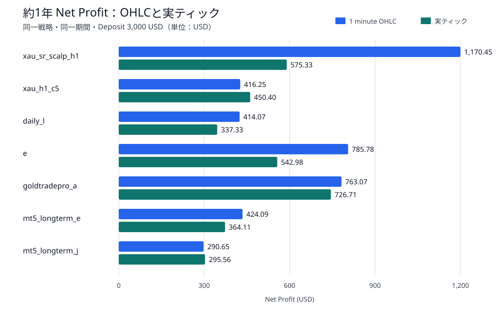
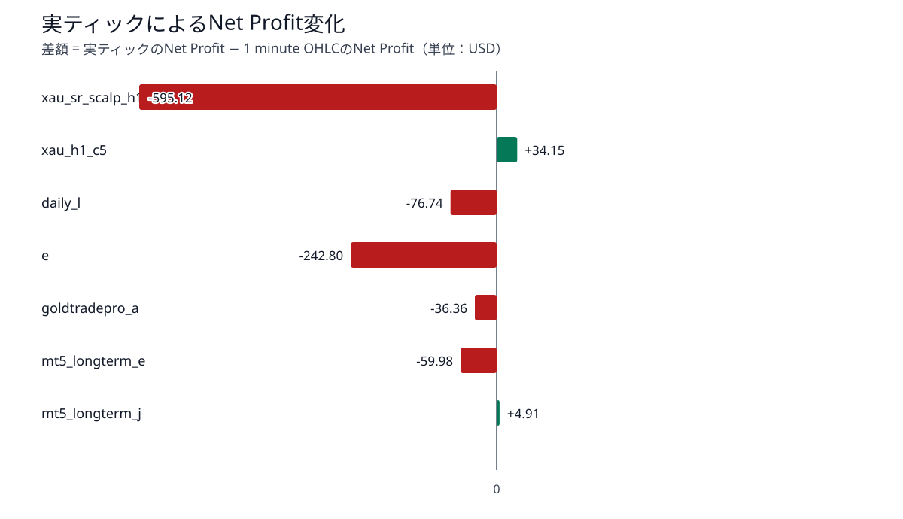
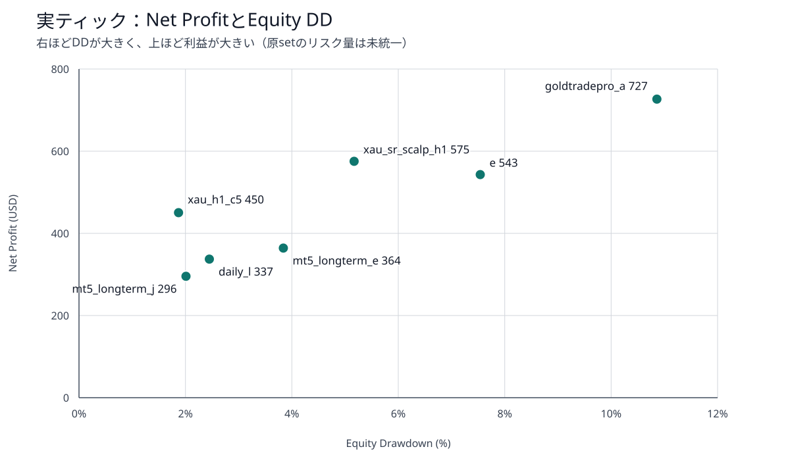
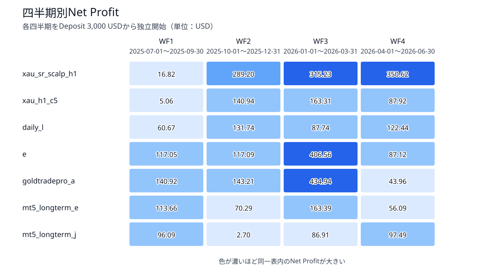

# Ultimate Breakout System Gold 7戦略比較 — 現在結果 暫定総合報告書

- 実行状態: **SUCCESS**
- 対象: Ultimate Breakout System v7.5 demo / XAUUSD用7戦略
- 主要比較: 四半期28件＋約1年モデリング方式比較14件＝42件
- 約1年期間: 2025-07-01～2026-06-30
- Deposit / Currency / Leverage: 3,000 USD / USD / 1:500
- 実行完了: 2026-09-03T14:17:40+09:00
- 報告書の位置づけ: Phase 0～2完了時点の暫定評価

## 1. 目的
本報告書の目的は、Ultimate Breakout System（UBS）のXAUUSD用set 7個について、原setの戦略設定を維持した状態で、収益性、四半期安定性、実ティック感応度、リスク効率を比較することである。

単純なNet Profit順位だけでなく、`1 minute OHLC`から`Every tick based on real ticks`へ変更したときに成績や取引系列がどの程度変化するかを確認し、次段階の同一リスク比較で重点的に検証すべき戦略を特定する。

本段階ではsetごとの資金管理設定を揃えていない。そのため、結果は**原設定の特徴比較**であり、最終的な優劣順位ではない。

## 2. 結果

### 2.1 総合結論

- 7戦略すべてが4四半期すべてで黒字だった。
- 約1年の連続テストでも、7戦略すべてがOHLC・実ティックの両方で黒字を維持した。
- 実ティックではOHLC比で5戦略の利益が減少し、2戦略の利益が増加した。大まかに言うと、1min OHLCの方がノイズが少なく、UBSには有利である。
- 最大のモデル差は`xau_sr_scalp_h1`の-595.12 USD（-50.85%）だった。
- Tradesは6戦略で同数だったが、deal系列SHA-256は7戦略すべてで異なった。取引数が同じでも、日時・方向・約定価格の少なくとも一部が変化している。
- `xau_h1_c5`と`mt5_longterm_j`は実ティックでNet Profitが増加し、モデル差が比較的小さい。
- `goldtradepro_a`は高利益を維持したが、実ティックEquity DDが10.86%で、他戦略よりリスク量が大きい。
- `xau_sr_scalp_h1`はOHLC利益が最大だった一方、実ティックで利益が50.85%減少し、モデル依存性が最も大きい。

### 2.2 約1年のモデリング方式比較

| 戦略 | OHLC NP | 実ティック NP | 差額 | 差率 | Trades | 実ティック PF | 実ティック RF | 実ティック DD |
|---|---:|---:|---:|---:|---:|---:|---:|---:|
| xau_sr_scalp_h1 | +1,170.45 | +575.33 | -595.12 | -50.85% | 133 → 133 | 1.47 | 3.27 | 5.17% |
| xau_h1_c5 | +416.25 | +450.40 | +34.15 | +8.20% | 110 → 111 | 2.77 | 7.80 | 1.87% |
| daily_l | +414.07 | +337.33 | -76.74 | -18.53% | 48 → 48 | 1.89 | 4.35 | 2.45% |
| e | +785.78 | +542.98 | -242.80 | -30.90% | 58 → 58 | 1.61 | 1.98 | 7.54% |
| goldtradepro_a | +763.07 | +726.71 | -36.36 | -4.76% | 54 → 54 | 3.03 | 1.73 | 10.86% |
| mt5_longterm_e | +424.09 | +364.11 | -59.98 | -14.14% | 159 → 159 | 1.95 | 3.08 | 3.84% |
| mt5_longterm_j | +290.65 | +295.56 | +4.91 | +1.69% | 92 → 92 | 1.96 | 4.72 | 2.01% |

OHLCから実ティックへの変更で、`xau_sr_scalp_h1`と`e`は特に大きく利益が低下した。反対に`xau_h1_c5`と`mt5_longterm_j`は利益を維持または増加させた。

### 2.3 実ティックでの利益とDrawdown

左上ほど低DD・高利益だが、原setのロット計算と最大保有数が異なるため、この図だけで最終順位を決めない。`xau_h1_c5`は実ティックNP 450.40 USD、DD 1.87%で、現設定では比較的良好な位置にある。`goldtradepro_a`はNP 726.71 USDと高いが、DDも10.86%である。

### 2.4 四半期安定性

| 戦略 | WF1 | WF2 | WF3 | WF4 | 4期合計 | 黒字期 | 最大DD |
|---|---:|---:|---:|---:|---:|---:|---:|
| xau_sr_scalp_h1 | +16.82 | +289.20 | +315.23 | +350.62 | +971.87 | 4/4 | 4.60% |
| xau_h1_c5 | +5.06 | +140.94 | +163.31 | +87.92 | +397.23 | 4/4 | 1.48% |
| daily_l | +60.67 | +131.74 | +87.74 | +122.44 | +402.59 | 4/4 | 2.44% |
| e | +117.05 | +117.09 | +406.56 | +87.12 | +727.82 | 4/4 | 5.37% |
| goldtradepro_a | +140.92 | +143.21 | +434.94 | +43.96 | +763.03 | 4/4 | 13.21% |
| mt5_longterm_e | +113.66 | +70.29 | +163.39 | +56.09 | +403.43 | 4/4 | 3.50% |
| mt5_longterm_j | +96.09 | +2.70 | +86.91 | +97.49 | +283.19 | 4/4 | 1.61% |

全28ケースが黒字だった。ただし、`xau_sr_scalp_h1`のWF1はPF 1.05、`mt5_longterm_j`のWF2はPF 1.02と損益分岐点に近い。`goldtradepro_a`はWF4でPF 1.17、Equity DD 13.21%まで悪化しており、期間依存性に注意が必要である。

## 3. 詳細

### 3.1 対象と固定条件

| 項目 | 条件 |
|---|---|
| EA | Ultimate Breakout System v7.5 demo |
| Symbol / Tester時間足 | XAUUSD / H1 |
| Deposit / Currency / Leverage | 3,000 USD / USD / 1:500 |
| Execution | No Delay |
| set | v6系原setを保持し、v7.5で不足する表示入力だけをTester基準値で補った忠実拡張set |
| 四半期モデル | 1 minute OHLC |
| 約1年モデル | 1 minute OHLC / Every tick based on real ticks |
| WF1 | 2025-07-01～2025-09-30 |
| WF2 | 2025-10-01～2025-12-31 |
| WF3 | 2026-01-01～2026-03-31 |
| WF4 | 2026-04-01～2026-06-30 |

### 3.2 実行件数と監査

| 監査項目 | 結果 |
|---|---:|
| 四半期比較 | 28/28成功 |
| 約1年OHLC | 7/7成功 |
| 約1年実ティック | 7/7成功 |
| 約1年比較ペア | 7/7生成 |
| 表示入力互換性 | 全件PASS |
| 実ティック品質ゲート | 7/7 PASS |
| HTMLレポート欠損 | 0 |
| 約1年比較のdeal系列一致 | 0/7 |

### 3.3 実ティックデータ品質

同期範囲は`2025.01.02`～`2026.08.28`で、対象期間全体を覆っている。対象352,554分足のうち24分に実ティックがなく、生成ティック補完率は0.006807%だった。約1年比較専用の許容上限0.01%以内であり、全7ケースを注記付きPASSとした。

短期スモークの既定監査は引き続き補完率0%を要求する。期間端不足、丸一日欠損、集計不能、0.01%超過は今回の比較でもFAILとなる。

### 3.4 モデル差の詳細

| 戦略 | NP差 | PF差 | RF差 | Sharpe差 | DD差 | Trades差 | deal系列 |
|---|---:|---:|---:|---:|---:|---:|---|
| xau_sr_scalp_h1 | -595.12 | -0.69 | -5.09 | +15.87 | +0.57 pp | +0 | 不一致 |
| xau_h1_c5 | +34.15 | -0.23 | -1.31 | +13.16 | +0.39 pp | +1 | 不一致 |
| daily_l | -76.74 | -0.37 | -0.85 | +0.16 | -0.12 pp | +0 | 不一致 |
| e | -242.80 | -0.53 | -1.77 | -0.57 | +2.07 pp | +0 | 不一致 |
| goldtradepro_a | -36.36 | -0.12 | -0.09 | -0.35 | +0.08 pp | +0 | 不一致 |
| mt5_longterm_e | -59.98 | -0.61 | -0.92 | +15.72 | +0.44 pp | +0 | 不一致 |
| mt5_longterm_j | +4.91 | -0.01 | +0.23 | +7.18 | -0.07 pp | +0 | 不一致 |

deal系列は、deal件数に加えて日時・方向・約定価格を順番どおり正規化したSHA-256で比較した。全戦略で不一致だったため、モデリング方式は単なる会計表示ではなく、約定経路へ影響している。

### 3.5 四半期合計と約1年連続テストの違い

四半期比較は各WFをDeposit 3,000 USDから独立に開始する。したがって、4期合計は四半期安定性を見る参考値であり、連続運用や複利運用の成績ではない。約1年テストは2025-07-01から2026-06-30まで資金状態を引き継ぐため、ロット調整、保有状態、期間境界の影響によって4期合計と一致しない場合がある。

### 3.6 戦略別の暫定評価

| 戦略 | 暫定評価 | 次に確認すべき点 |
|---|---|---|
| xau_sr_scalp_h1 | OHLC利益は最大だが、実ティックで大幅減 | モデル差と価格経路への依存 |
| xau_h1_c5 | 低DDで実ティック利益が増加 | 同一リスク化後も優位か |
| daily_l | 四半期安定性と低DDが良好 | 48取引という標本数 |
| e | 高利益だがモデル差とDD上昇が大きい | 実ティック環境でのリスク |
| goldtradepro_a | 高利益を維持しモデル差は小さめ | DDとWF4悪化 |
| mt5_longterm_e | 159取引で比較的評価しやすい | 同一リスク時の効率 |
| mt5_longterm_j | 利益は小さいがモデル差とDDが小さい | WF2の損益分岐点接近 |

### 3.7 制約

- 各setの正確な最適化期間とフォワード期間が残っていないため、厳密なOut-of-Sample成績とは断定できない。
- setごとに`LotPerBalance_step`、`HistoricalMaxDD`、`MaxTrades`などが異なり、利益額とリスク量を分離できていない。
- 使用EAはv7.5デモ版であり、将来利用する製品版との完全同一性は保証できない。
- 実ティック比較は直近約1年に限定される。
- 遅延、ランダム延滞、Commission・Swapストレス、低資金耐性、戦略間相関は未評価である。

### 3.8 次段階

1. 資金管理パラメータの小規模感応度テストを行う。
2. 同一リスクの定義と目標DDを決定し、Phase 3を実行する。
3. 固定・ランダム遅延と取引コスト耐性を評価する。
4. 初期資金耐性と日次・週次損益相関を評価する。
5. 上記完了後、最終順位とポートフォリオ候補を含む最終報告書へ更新する。

### 3.9 正本成果物

- 四半期比較: `data/ubs_strategy_comparison/quarterly_1m_ohlc/20260902T155309727908_b95bac15/`
- 約1年モデル比較: `data/ubs_strategy_comparison/model_comparison_1y/20260902T162029093739_4e2ec09f/`
- 約1年戦略別比較: `data/ubs_strategy_comparison/model_comparison_1y/20260902T162029093739_4e2ec09f/model_comparison_pairs.csv`

