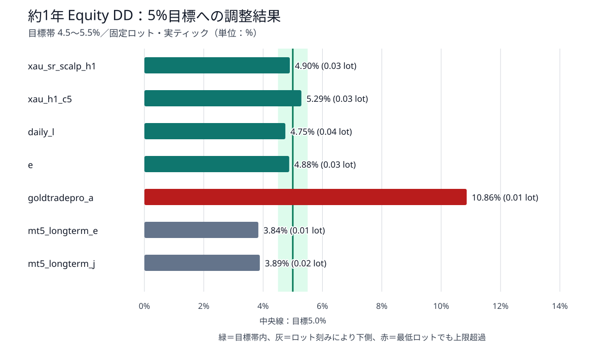
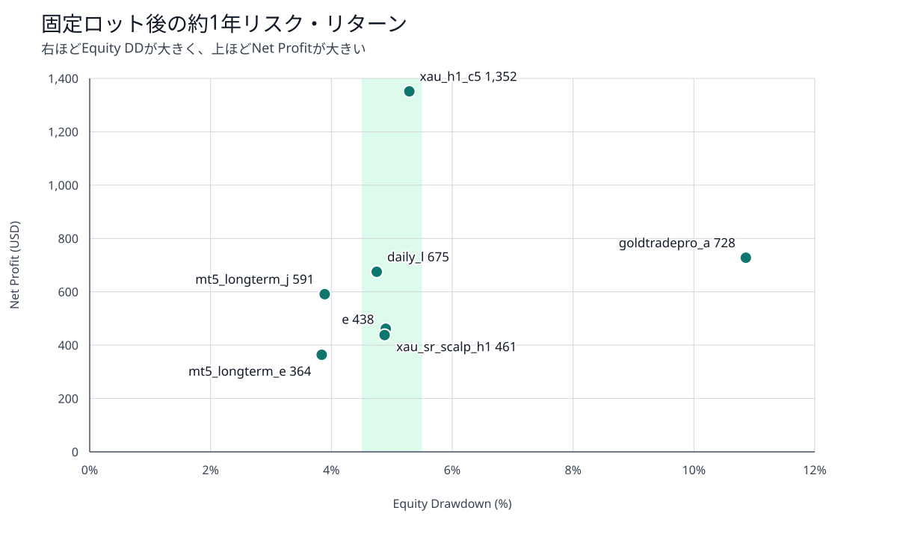
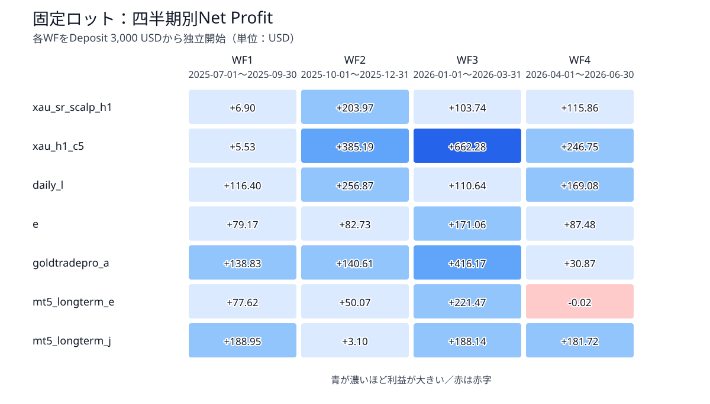
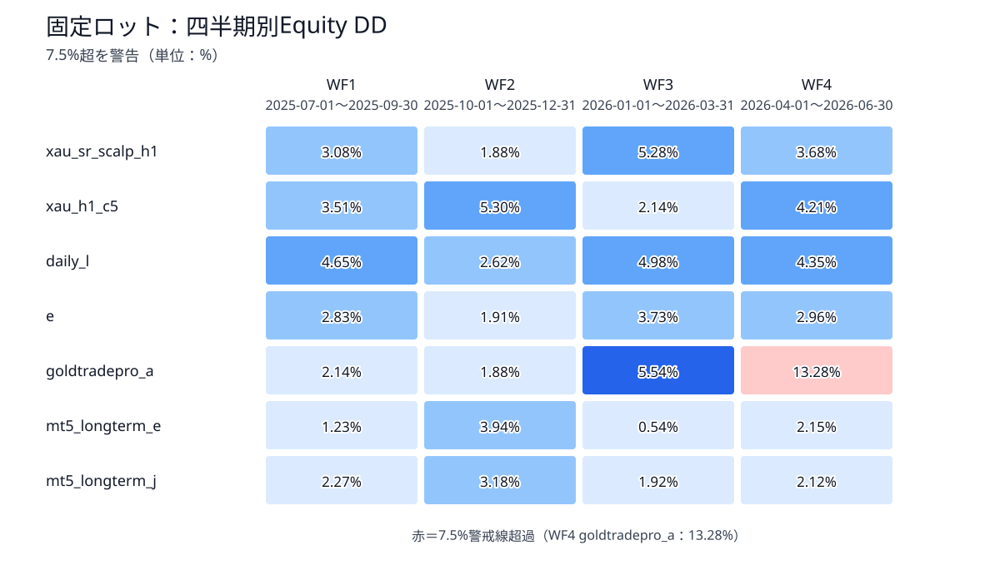

# Ultimate Breakout System Gold 7戦略 — 同一リスク比較・四半期安全確認 総合報告書

- 実行状態: **SUCCESS**
- 対象: Ultimate Breakout System v7.5 demo / XAUUSD用7戦略
- 評価段階: Phase 3（固定ロットによる年間DD調整と四半期安全確認）
- 主要実測: 年間ロット候補11件＋四半期28件＝39件
- 期間: 2025-07-01～2026-06-30（WF1～WF4）
- Deposit / Currency / Leverage: 3,000 USD / USD / 1:500
- モデル / Execution: Every tick based on real ticks / No Delay
- 実行完了: 2026-09-04T17:42:23+09:00

## 1. 目的

<span style="color:yellow;">本報告書の目的は、Ultimate Breakout System（UBS）のXAUUSD用7戦略を、原setの異なる資金管理設定のまま比較する段階から一歩進め、固定ロットによって約1年の最大Equity Drawdown（DD）を概ね5%へ近づけた条件で（リスク水準をそろえたということ）、収益性と四半期安定性を比較することである。</span>

目標はDD 5.0%、許容帯は4.5～5.5%とした。選択したロットを変えずにWF1～WF4を実ティックで独立テストし、各四半期のDD 7.5%超を安全上の警告として検出した。

ここでいう5%はバックテスト結果を揃えるための比較基準であり、EAの強制決済条件やライブ運用時の損失停止トリガーではない。

## 2. 結論

### 2.1 総合判断

- <span style="color:yellow;">年間DDを目標帯へ収められたのは4/7戦略だった。xau_sr_scalp_h1、xau_h1_c5、daily_l、eである。</span>
- `mt5_longterm_e`と`mt5_longterm_j`は0.01 lot刻みの制約により、上側候補が5.5%を超えるため安全側の低いロットを選んだ。
- `goldtradepro_a`は最低ロット0.01でも年間DD 10.86%だった。この戦略だけは他6戦略とリスクを揃えられておらず、利益額を横並びで順位付けできない。
- <span style="color:yellow;">目標帯内の4戦略では、xau_h1_c5が年間Net Profit +1,351.68 USD、PF 2.77で最も高い。daily_lは+675.19 USD、DD 4.75%で次に高い。</span>
- 四半期は28/28件が正常完了し、27/28件が黒字だった。唯一の赤字は`WF4_mt5_longterm_e`の-0.02 USDで、実質的に損益分岐だった。
- 四半期DD 7.5%超は1件だけで、`WF4_goldtradepro_a`の13.28%だった。年間の最低ロット制約が四半期でもリスクとして表面化した。
- 現段階では、同一DD帯で収益性が最も高い候補は`xau_h1_c5`、収益と安定性のバランス候補は`daily_l`である。ただし最適化期間の正確な記録がないため、最終順位ではなく次段階へ進める候補評価とする。

### 2.2 約1年DDの調整結果



| 戦略 | 固定lot | Net Profit | Trades | PF | RF | Sharpe | Equity DD | 選択結果 |
|---|---:|---:|---:|---:|---:|---:|---:|---|
| xau_sr_scalp_h1 | 0.03 | +461.46 | 133 | 1.51 | 2.83 | 44.34 | 4.90% | 目標帯内 |
| xau_h1_c5 | 0.03 | +1,351.68 | 111 | 2.77 | 7.80 | 36.64 | 5.29% | 目標帯内 |
| daily_l | 0.04 | +675.19 | 48 | 1.89 | 4.35 | 14.79 | 4.75% | 目標帯内 |
| e | 0.03 | +437.81 | 58 | 1.70 | 2.60 | 12.70 | 4.88% | 目標帯内 |
| goldtradepro_a | 0.01 | +727.61 | 54 | 3.04 | 1.73 | 6.99 | 10.86% | 最低ロットでも上限超過 |
| mt5_longterm_e | 0.01 | +364.11 | 159 | 1.95 | 3.08 | 37.96 | 3.84% | ロット刻みにより下側 |
| mt5_longterm_j | 0.02 | +591.15 | 92 | 1.96 | 4.72 | 23.62 | 3.89% | ロット刻みにより下側 |

緑の目標帯内へ4戦略を収めた。灰色の2戦略はロット刻みのため意図的に安全側を選択し、赤色の`goldtradepro_a`は最低ロットでも上限を超えた。

### 2.3 年間リスク・リターン



目標帯内では`xau_h1_c5`が明確に高いNet Profitを示した。`mt5_longterm_e`と`mt5_longterm_j`はDDが目標より低いため、利益額が小さいことだけを理由に劣後とは判断しない。`goldtradepro_a`は目標帯外なので、この図でも別枠として読む必要がある。

### 2.4 四半期収益



| 戦略 | WF1 | WF2 | WF3 | WF4 | 4期単純合計 | 黒字期 |
|---|---:|---:|---:|---:|---:|---:|
| xau_sr_scalp_h1 | +6.90 | +203.97 | +103.74 | +115.86 | +430.47 | 4/4 |
| xau_h1_c5 | +5.53 | +385.19 | +662.28 | +246.75 | +1,299.75 | 4/4 |
| daily_l | +116.40 | +256.87 | +110.64 | +169.08 | +652.99 | 4/4 |
| e | +79.17 | +82.73 | +171.06 | +87.48 | +420.44 | 4/4 |
| goldtradepro_a | +138.83 | +140.61 | +416.17 | +30.87 | +726.48 | 4/4 |
| mt5_longterm_e | +77.62 | +50.07 | +221.47 | -0.02 | +349.14 | 3/4 |
| mt5_longterm_j | +188.95 | +3.10 | +188.14 | +181.72 | +561.91 | 4/4 |

`xau_h1_c5`はWF2・WF3で大きく伸び、4期単純合計でも+1,299.75 USDだった。`xau_sr_scalp_h1`と`xau_h1_c5`はWF1のPFがともに1.03、`mt5_longterm_j`はWF2のPFが1.01であり、黒字でも損益分岐点に近い期間がある。

### 2.5 四半期DD



| 戦略 | WF1 | WF2 | WF3 | WF4 | 四半期最大DD | 発生期 | 警告 |
|---|---:|---:|---:|---:|---:|---|---:|
| xau_sr_scalp_h1 | 3.08% | 1.88% | 5.28% | 3.68% | 5.28% | WF3 | 0 |
| xau_h1_c5 | 3.51% | 5.30% | 2.14% | 4.21% | 5.30% | WF2 | 0 |
| daily_l | 4.65% | 2.62% | 4.98% | 4.35% | 4.98% | WF3 | 0 |
| e | 2.83% | 1.91% | 3.73% | 2.96% | 3.73% | WF3 | 0 |
| goldtradepro_a | 2.14% | 1.88% | 5.54% | 13.28% | 13.28% | WF4 | 1 |
| mt5_longterm_e | 1.23% | 3.94% | 0.54% | 2.15% | 3.94% | WF2 | 0 |
| mt5_longterm_j | 2.27% | 3.18% | 1.92% | 2.12% | 3.18% | WF2 | 0 |

`goldtradepro_a`はWF1～WF3ではDD 1.88～5.54%だったが、WF4で13.28%へ急増した。年間DD 10.86%だけでなく、期間別にも損失の偏りが確認されたため、現ロットのまま他戦略と同じリスク枠へ含めるべきではない。

## 3. 詳細

### 3.1 対象期間と固定条件

| 項目 | 条件 |
|---|---|
| EA | Ultimate Breakout System v7.5 demo |
| Symbol / Tester時間足 | XAUUSD / H1 |
| Deposit / Currency / Leverage | 3,000 USD / USD / 1:500 |
| モデル | Every tick based on real ticks |
| Execution | No Delay |
| 年間期間 | 2025-07-01～2026-06-30 |
| WF1 | 2025-07-01～2025-09-30 |
| WF2 | 2025-10-01～2025-12-31 |
| WF3 | 2026-01-01～2026-03-31 |
| WF4 | 2026-04-01～2026-06-30 |
| 年間DD目標 | 5.0%（許容帯4.5～5.5%） |
| 四半期警戒線 | Equity DD 7.5%超 |

### 3.2 同一リスク化の方法

資金管理方式のパイロットテストにより、UBS v7.5では`Risk=0`を固定ロット方式として使用できることを確認した。派生setでは次の値だけを資金管理用に設定し、売買ロジック、取引上限、エントリー条件、決済条件は変更していない。

```text
Risk = 0
AdjustLotsizeToVariableValues = false
StartLots = 選択lot
MaxLots = 選択lot
```

年間結果と四半期結果の全entry dealについて、最小volumeと最大volumeが選択lotに一致することを監査した。年間候補では元結果とdeal系列も一致しており、ロット量を変えても売買日時・方向・約定価格の経路を維持したことを確認している。

### 3.3 ロット候補と選択理由

| 戦略 | 測定候補（lot → 年間DD） | 採用lot | 判断 |
|---|---|---:|---|
| xau_sr_scalp_h1 | 0.03 → 4.90%, 0.04 → 6.34% | 0.03 | 目標帯内 |
| xau_h1_c5 | 0.02 → 3.63%, 0.03 → 5.29% | 0.03 | 目標帯内 |
| daily_l | 0.04 → 4.75% | 0.04 | 目標帯内 |
| e | 0.03 → 4.88% | 0.03 | 目標帯内 |
| goldtradepro_a | 0.01 → 10.86% | 0.01 | 最低ロットでも上限超過 |
| mt5_longterm_e | 0.01 → 3.84%, 0.02 → 7.48% | 0.01 | ロット刻みにより下側 |
| mt5_longterm_j | 0.02 → 3.89%, 0.03 → 5.64% | 0.02 | ロット刻みにより下側 |

候補選択は5.0%への絶対距離だけでなく、許容上限5.5%を優先した。例えば`mt5_longterm_j`は0.03 lotのDD 5.64%の方が目標へ近いが、上限を超えるため0.02 lot（3.89%）を採用した。

### 3.4 原設定から固定ロットへの変化

| 戦略 | 原設定 NP | 原設定 DD | 固定lot NP | 固定lot DD | NP差 | DD差 |
|---|---:|---:|---:|---:|---:|---:|
| xau_sr_scalp_h1 | +575.33 | 5.17% | +461.46 | 4.90% | -113.87 | -0.27 pp |
| xau_h1_c5 | +450.40 | 1.87% | +1,351.68 | 5.29% | +901.28 | +3.42 pp |
| daily_l | +337.33 | 2.45% | +675.19 | 4.75% | +337.86 | +2.30 pp |
| e | +542.98 | 7.54% | +437.81 | 4.88% | -105.17 | -2.66 pp |
| goldtradepro_a | +726.71 | 10.86% | +727.61 | 10.86% | +0.90 | +0.00 pp |
| mt5_longterm_e | +364.11 | 3.84% | +364.11 | 3.84% | +0.00 | +0.00 pp |
| mt5_longterm_j | +295.56 | 2.01% | +591.15 | 3.89% | +295.59 | +1.88 pp |

この差は戦略ロジックの改善ではなく、資金管理方式と取引量を固定したことによるエクスポージャー変更である。したがって、NP増加を最適化効果とは解釈しない。

### 3.5 四半期合計と年間連続テスト

| 戦略 | 年間連続NP | 四半期単純合計 | 差（四半期合計 − 年間） |
|---|---:|---:|---:|
| xau_sr_scalp_h1 | +461.46 | +430.47 | -30.99 |
| xau_h1_c5 | +1,351.68 | +1,299.75 | -51.93 |
| daily_l | +675.19 | +652.99 | -22.20 |
| e | +437.81 | +420.44 | -17.37 |
| goldtradepro_a | +727.61 | +726.48 | -1.13 |
| mt5_longterm_e | +364.11 | +349.14 | -14.97 |
| mt5_longterm_j | +591.15 | +561.91 | -29.24 |

各WFは毎回Deposit 3,000 USDから独立して開始する。一方、年間テストは資金状態と保有状態を期間全体で引き継ぐ。このため四半期単純合計は年間連続テストと一致せず、複利運用結果やポートフォリオ収益を表すものでもない。

### 3.6 完全性・品質監査

| 監査項目 | 結果 |
|---|---:|
| 年間ロット候補 | 11/11成功 |
| 最終選択 | 7/7、選択元result・set SHA-256付き |
| 四半期実ティック | 28/28成功 |
| 表示入力互換性 | 年間選択7件＋四半期28件すべてPASS |
| entry固定lot | 年間選択7件＋四半期28件すべて一致 |
| 実ティック品質 | 年間選択7件＋四半期28件すべてPASS |
| 四半期DD警告 | 1件 |

年間では352,554分足のうち24分に実ティックがなく、生成ティック補完率は0.006807%だった。年間上限0.01%以内のため注記付きPASSとした。

四半期の補完分数はWF1=24分、WF2=0分、WF3=0分、WF4=0分だった。WF1の24分は年間と同じ既知区間で、四半期上限0.03%かつ絶対数24分以下を満たした。7戦略で同じ市場データを使うため、これは戦略ごとに別の欠損が累積したものではない。

### 3.7 戦略別の判断

| 戦略 | 現段階の判断 | 主な注意点 |
|---|---|---|
| xau_sr_scalp_h1 | 目標DD帯内、4期すべて黒字 | WF1 PF 1.03、モデル感応度は前段階で大きかった |
| xau_h1_c5 | 目標帯内で年間・四半期合計とも収益首位 | WF1 PF 1.03、WF2 DD 5.30% |
| daily_l | 目標帯内で4期黒字、比較的均衡 | 年間48 tradesで標本数が少ない |
| e | 目標帯内で4期黒字 | 年間利益は目標帯内4戦略で最小 |
| goldtradepro_a | 高利益だが同一リスク比較から除外相当 | 最低lotでも年間DD 10.86%、WF4 DD 13.28% |
| mt5_longterm_e | 安全側lot、年間159 trades | WF4 -0.02 USD、ロット刻みでDD目標未達 |
| mt5_longterm_j | 安全側lot、4期黒字 | WF2 PF 1.01、ロット刻みでDD目標未達 |

### 3.8 制約

- 各setの正確な最適化期間とフォワード期間が残っていないため、厳密なOut-of-Sample比較とは断定できない。
- 過去約1年の最大DDを5%へ近づけても、将来のDDが5%以内になる保証はない。
- 0.01 lot刻みでは全戦略のDDを完全一致させられない。4戦略だけが許容帯内、2戦略は下側、1戦略は上側である。
- DD 7.5%は警告基準であり、テスター内の決済トリガーではない。
- No Delayの結果であり、遅延・追加コスト・スリッページ耐性は本報告書の対象外である。
- 戦略を同時稼働した場合の証拠金競合、損益相関、ポートフォリオDDは未評価である。

### 3.9 次段階

1. `goldtradepro_a`を別リスク枠に分離するか、より小さい取引単位を利用できる環境を検討する。
2. `xau_h1_c5`と`daily_l`を中心に、固定・ランダム遅延と取引コスト耐性を確認する。
3. 初期資金を下げたCapital Stressと、複数戦略同時運用時の証拠金・相関・合成DDを評価する。

### 3.10 正本成果物

- 最終ロット選択: `data/ubs_strategy_comparison/risk_sensitivity/annual_adjustments/20260904T132413597926_c84df372/selection_v2/final_selection.json`
- 四半期実ティック結果: `data/ubs_strategy_comparison/risk_sensitivity/quarterly_real_ticks/20260904T142905226930_1d391678/`
- 四半期集計: `data/ubs_strategy_comparison/risk_sensitivity/quarterly_real_ticks/20260904T142905226930_1d391678/quarterly_same_risk_summary.csv`
- 原設定の約1年比較: `data/ubs_strategy_comparison/model_comparison_1y/20260902T162029093739_4e2ec09f/`
