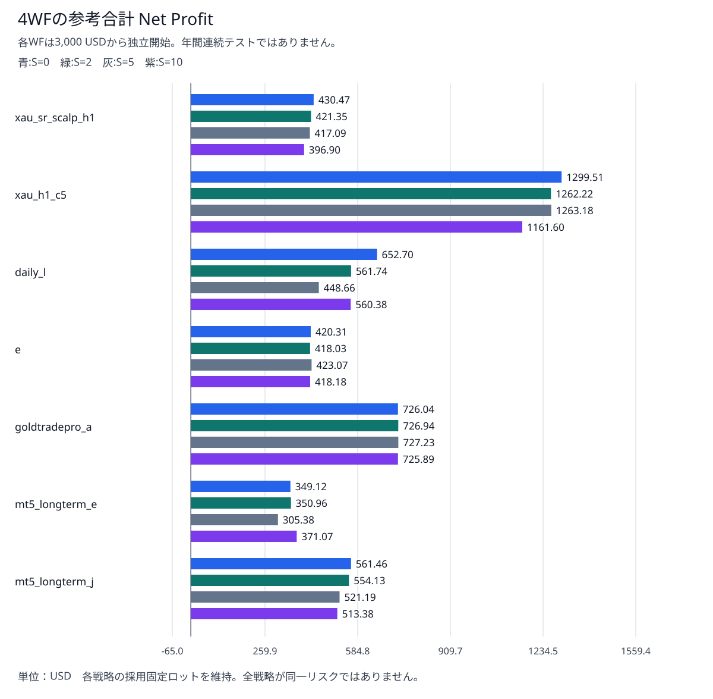
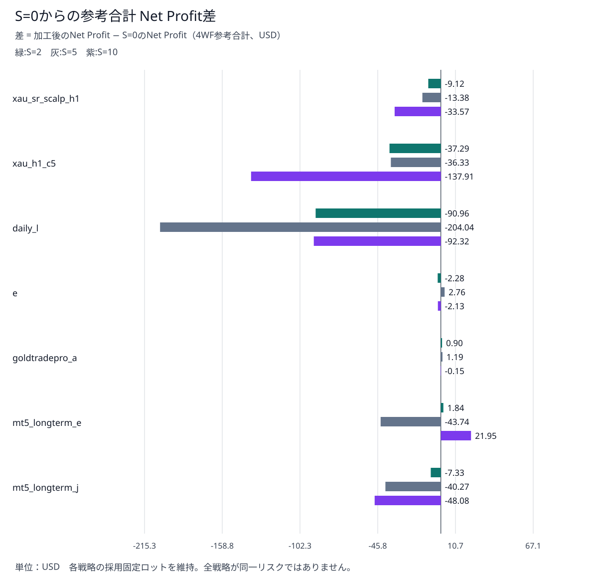
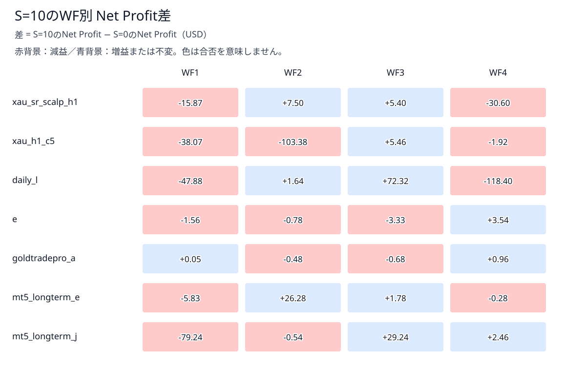
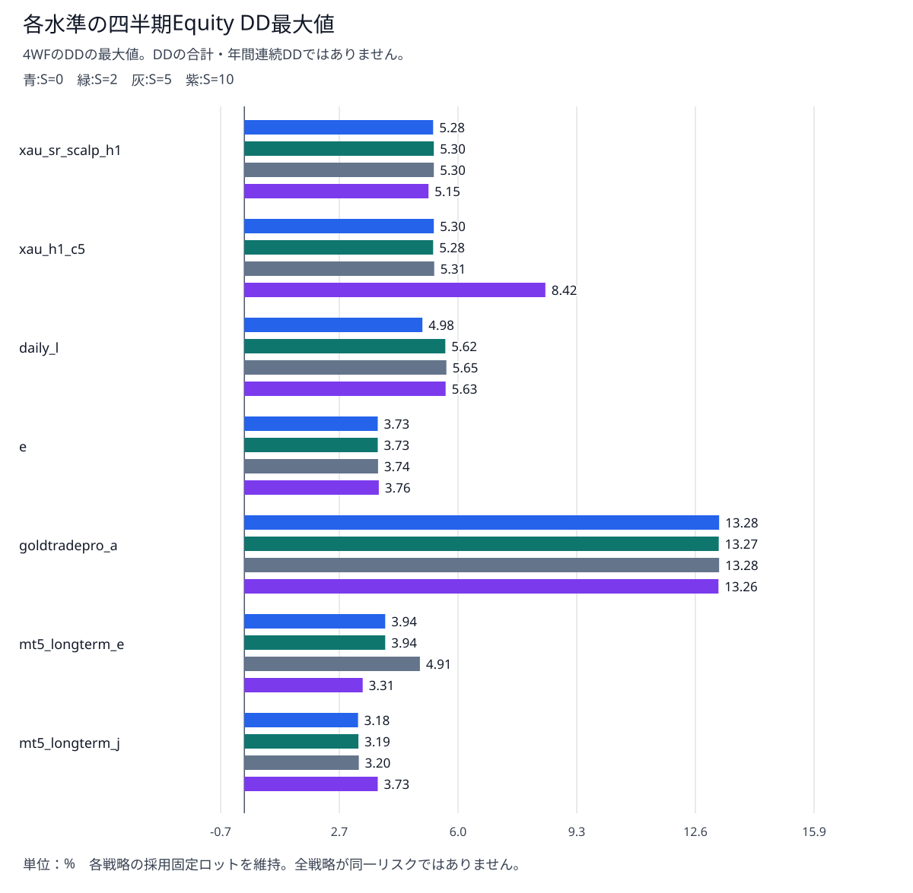

# Ultimate Breakout System Gold 7戦略 — 取引コスト耐性（スリッページ関連・第1層）総合報告書

作成日：2026-09-11。対象：UBS v7.5 demo、ゴールド用7 set。比較112/112件完了。

## 1. 目的

### 1.1 これまでの検証との関係

<span style="color:yellow;">[第1報告書](ubs_gold_strategy_comparison.md)は原setでの戦略比較、[第2報告書](ubs_same_risk_comparison.md)は固定ロットによるリスク調整、[第3報告書（7戦略版）](ubs_execution_delay_all_strategies.md)は約定遅延耐性を扱った。今回は第2報告書で採用したロットを維持し、売買価格の差（スプレッド）が広がった場合の損益・Equity DD・取引系列への影響を調べる。</span>

ここでいう「第1層」はスリッページ関連の評価手法の区分であり、UBSの「第1報告書」を指す番号ではない。以前QQ・Smart Gold Hunter・Wave Riderで実施した第1層と同じ価格加工方式を使う。

| 層 | 位置づけ | 今回の扱い |
|---|---|---|
| <span style="color:yellow;">第1層</span> | <span style="color:yellow;">Bid/Askを加工し、取引コストと価格判断への感応度をバックテストする</span> | <span style="color:yellow;">本報告書の対象</span> |
| 第2層 | EAの許容偏差設定と約定遅延などの組合せへの感応度を調べる | 以前はQQのInpSlippageで実施。UBSで同じ機能を検証したという意味ではない |
| 第3層 | フォワード稼働の要求価格・実約定価格・遅延等を記録して現実の執行を評価する | 今回は未実施 |

<span style="color:yellow;">純粋な実約定スリッページの測定ではない。スリッページとは要求した価格と実際の約定価格との差であり、本試験はその不利な価格・コスト影響の一部を模擬する。価格データ自体を変えるため、EAの注文判断も変わり得る。</span>

### 1.2 変更する量Sと価格加工

**Sは、BidとAskをそれぞれ外側へ動かす幅をpoints単位で表した数値**である。S=0が無加工の基準で、S=2・5・10を比較した。この銘柄のPointは0.01 USD/金価格単位である。

```text
Bid' = Bid − S × Point
Ask' = Ask ＋ S × Point
加工後のスプレッド = 元のスプレッド ＋ 2 × S × Point
```

Bidは売れる価格、Askは買える価格、プライム（'）は加工後を表す。買うときのAskを高く、売るときのBidを低くし、<span style="color:yellow;">不利な価格で売買する条件を作る。</span>固定手数料を損益から一括控除した計算とは異なる。

| S (points) | Bidの変更 | Askの変更 | スプレッド増分 | 7戦略×4WF |
|---|---|---|---|---|
| 0 | −0.00 | +0.00 | 0 points / 0.00 USD | 28 |
| 2 | −0.02 | +0.02 | 4 points / 0.04 USD | 28 |
| 5 | −0.05 | +0.05 | 10 points / 0.10 USD | 28 |
| 10 | −0.10 | +0.10 | 20 points / 0.20 USD | 28 |

例：元Bid=2500.00、Ask=2500.15、S=5なら、Bid'=2499.95、Ask'=2500.20となり、スプレッドは0.15から0.25へ広がる。ここでのUSDは価格差で、口座の損失額そのものではない。損益への換算にはロット・契約サイズ・実際の注文/決済が関係する。

### 1.3 MT5でどこを変更したか

<span style="color:yellow;">加工済みティックを入れたカスタムシンボルを用意し、ストラテジーテスターの「銘柄」で選択した。</span>Sというテスター標準欄を変更したわけではない。銘柄内には加工後のBid'・Ask'を持つティックが収められている。M1のOHLCは−S×Point、spreadは+2S pointsとする既存方式も維持した。

| S | テスト銘柄 |
|---|---|
| 0 | XAUUSD_TCS0_5a220d89 |
| 2 | XAUUSD_TCS2_6cc71094 |
| 5 | XAUUSD_TCS5_e479cd1e |
| 10 | XAUUSD_TCS10_6cc71094 |

<span style="color:yellow;">遅延は全件No Delay（ExecutionMode=0）。</span>今回、ランダム遅延や固定188msを組み合わせていない。

## 2. 結果

### 2.1 総合判断

- <span style="color:yellow;">**eは今回の範囲で相対的に変化が小さい。**</span> 4WF合計NPはS=0の420.31 USDに対し、S=2/5/10で418.03/423.07/418.18 USD。全16件が黒字で、四半期DD最大は3.73～3.76%。ただし年間リスク・将来収益の保証ではない。
- <span style="color:yellow;">**xau_h1_c5は合計利益首位を維持するが、S=10のリスク上昇に注意。** 合計NPは1299.51→1161.60 USD（−10.61%）。WF1はS=2から赤字（3.5と2.4を参照）、WF2のDDはS=10で8.42%となった（2.4参照）。遅延耐性の良さだけでは価格コスト耐性を判断できない。</span>
- <span style="color:yellow;">**daily_lは全16件黒字だが、減益感応度が大きく非単調。**</span> S=5の合計NPは448.66 USD（S=0比−31.26%）。S=10は560.38 USDへ戻る一方、WF4は169.08→50.68 USDと大きく減少した。
- xau_sr_scalp_h1は合計NPが430.47→396.90 USD、S=10のWF1が−8.97 USD。全水準・全期間で黒字という結果ではない。
- <span style="color:yellow;">goldtradepro_aはNP変化が小さいが、WF4のDDは13%台（2.4参照）。</span>最低lotでも高DDのため、これを「総合的に低リスク」と評価しない。
- mt5_longterm_e・mt5_longterm_jは取引数も変化する。前者はS=5で減益しS=10で増益、後者はS増加に伴い合計NPが減少した。両者は第2報告書のDD目標帯より低いロット側を採用しており、全戦略を同一リスクの収益順位として扱わない。

以上は今回の同じ過去データ・選定済みロットにおける相対評価であり、実運用候補の確定や新しい合否基準ではない。

### 2.2 4WFの参考合計NP



NP（Net Profit）は純損益、単位はUSD。**各WFを3,000 USDから独立開始した4件の単純合計**であり、約1年間の連続バックテストでも複利運用でもない。

| 戦略 | lot | S=0 | S=2 | S=5 | S=10 | S=10差 | S=10変化率 |
|---|---|---|---|---|---|---|---|
| xau_sr_scalp_h1 | 0.03 | 430.47 | 421.35 | 417.09 | 396.90 | -33.57 | -7.80% |
| xau_h1_c5 | 0.03 | 1299.51 | 1262.22 | 1263.18 | 1161.60 | -137.91 | -10.61% |
| daily_l | 0.04 | 652.70 | 561.74 | 448.66 | 560.38 | -92.32 | -14.14% |
| e | 0.03 | 420.31 | 418.03 | 423.07 | 418.18 | -2.13 | -0.51% |
| goldtradepro_a | 0.01 | 726.04 | 726.94 | 727.23 | 725.89 | -0.15 | -0.02% |
| mt5_longterm_e | 0.01 | 349.12 | 350.96 | 305.38 | 371.07 | +21.95 | +6.29% |
| mt5_longterm_j | 0.02 | 561.46 | 554.13 | 521.19 | 513.38 | -48.08 | -8.56% |



- 差 = 加工後のNet Profit − S=0のNet Profit。プラスは増益、マイナスは減益。差の図ではS=0の棒を描かないため、S=0の凡例も設けていない。
- <span style="color:yellow;">eとgoldtradepro_aは差が小さい。</span>

### 2.3 WF別の変化と非単調性



daily_lのWF3はS=5で67.21 USD、S=10で182.97 USDとなり、全体合計の戻りに大きく関係する。一方WF4はS=5で53.96、S=10で50.68 USDである。合計だけではこの期間差が隠れる。

価格を変えるとエントリー/決済のタイミングや到達するTP/SL、追従する注文条件などが変わり得る。これが「経路依存性」で、途中の価格・状態の違いがその後の取引結果を変える性質をいう。本書では個別EA内部の分岐原因を特定していないため、非単調な増益を「スリッページが利益を改善する」と解釈しない。
### 2.4 DDと黒字期間数



| 戦略 | DD S=0 | DD S=2 | DD S=5 | DD S=10 | 黒字WF数 S=0/2/5/10 |
|---|---|---|---|---|---|
| xau_sr_scalp_h1 | 5.28% | 5.30% | 5.30% | 5.15% | 4/4 / 4/4 / 4/4 / 3/4 |
| xau_h1_c5 | 5.30% | 5.28% | 5.31% | <span style="color:yellow;">8.42%</span> | 4/4 / 3/4 / 3/4 / 3/4 |
| daily_l | 4.98% | 5.62% | 5.65% | 5.63% | 4/4 / 4/4 / 4/4 / 4/4 |
| e | 3.73% | 3.73% | 3.74% | 3.76% | 4/4 / 4/4 / 4/4 / 4/4 |
| goldtradepro_a | <span style="color:yellow;">13.28%</span> | <span style="color:yellow;">13.27%</span>| <span style="color:yellow;">13.28%</span>  | <span style="color:yellow;">13.26%</span> | 4/4 / 4/4 / 4/4 / 4/4 |
| mt5_longterm_e | 3.94% | 3.94% | 4.91% | 3.31% | 3/4 / 4/4 / 4/4 / 3/4 |
| mt5_longterm_j | 3.18% | 3.19% | 3.20% | 3.73% | 4/4 / 4/4 / 4/4 / 4/4 |

DDはEquity（含み損益を含む有効証拠金）の下落率。上表は各水準の4WF中の最大値で、年間DDではない。第2報告書の約5%は過去年間テストでのロット選定目標であり、5%到達時の強制決済ではない。

事前の[リスク基準](../decisions/20260903_ubs_same_risk_criterion.md)にある7.5%警告値を超えたのは、goldtradepro_aのWF4全4水準とxau_h1_c5のWF2/S=10の計5件。7.5%は統計的安全限界でもMT5標準の決済条件でもない。

| <span style="color:yellow;">赤字ケース</span> | S | NP USD | DD % |
|---|---|---|---|
| xau_sr_scalp_h1 / WF1 | 10 | -8.97 | 3.52 |
| xau_h1_c5 / WF1 | 2 | -31.98 | 3.52 |
| xau_h1_c5 / WF1 | 5 | -31.92 | 3.50 |
| xau_h1_c5 / WF1 | 10 | -32.73 | 3.50 |
| mt5_longterm_e / WF4 | 0 | -0.02 | 2.15 |
| mt5_longterm_e / WF4 | 10 | -0.30 | 2.24 |

### 2.5 取引系列と取引数

deal系列は約定を日時順に並べたもの。本プロジェクトのdeal系列SHA-256は、日時・売買方向・約定価格を正規化・ソートし、同一約定の重複数も含めて計算する。同時刻内の行順、数量、新規/決済区分そのものはこのハッシュの比較対象ではない。新規約定の数量は別の固定lot監査で確認する。同じ取引数でも各約定の価格などが異なればハッシュは変わる。<span style="color:yellow;">下の表の3列目は、約定の日時・売買方向・価格がS=0と一致したWFの数を表す。4列目は、取引数がS=0から変化したWFの数である。</span>

| 戦略 | Trades S=0/2/5/10 | 系列一致WF数 S=2/5/10 | Trades変化WF数 S=2/5/10 |
|---|---|---|---|
| xau_sr_scalp_h1 | 131 / 131 / 131 / 131 | 0/4 / 0/4 / 0/4 | 0/4 / 0/4 / 0/4 |
| xau_h1_c5 | 109 / 109 / 109 / 109 | 0/4 / 0/4 / 0/4 | 0/4 / 0/4 / 0/4 |
| daily_l | 47 / 47 / 47 / 47 | 0/4 / 0/4 / 0/4 | 0/4 / 0/4 / 0/4 |
| e | 57 / 57 / 57 / 57 | 0/4 / 0/4 / 0/4 | 0/4 / 0/4 / 0/4 |
| goldtradepro_a | 54 / 54 / 54 / 54 | 0/4 / 0/4 / 0/4 | 0/4 / 0/4 / 0/4 |
| mt5_longterm_e | 155 / 156 / 158 / 158 | 0/4 / 0/4 / 0/4 | 1/4 / 2/4 / 1/4 |
| mt5_longterm_j | 90 / 91 / 93 / 98 | 0/4 / 0/4 / 0/4 | 1/4 / 2/4 / 2/4 |

正ストレス84件のdeal系列はすべて各自のS=0と異なった。今回はBid/Askの価格加工を行っているため、価格が変わるだけでもこの不一致は起こる。全84件でエントリー判断が変わった、または7戦略が独立であるという証明ではない。Tradesの変化は長期型2戦略の計9件で観測した。

## 3. 詳細

### 3.1 条件・ロット・期間

| 項目 | 条件 |
|---|---|
| EA | Ultimate Breakout System v7.5 demo。選定済みsetと前段階のv7.5互換設定を保持 |
| テスター | H1 / Every tick based on real ticks / No Delay |
| 初期入金等 | 3,000 USD / USD / 1:500 |
| 固定lot方式 | Risk=0、AdjustLotsizeToVariableValues=false、StartLots=MaxLots=採用lot |
| 件数 | 7戦略 × 4WF × 4水準 = 112件。各戦略16件 |
| 別枠 | 通常銘柄基準更新28件、診断/試行、カスタムデータ生成は112件に含めない |
| 実行負荷 | BelowNormal、最大4論理CPU、直列。今回の報告書作成では再計算なし |

| 戦略 | 固定lot | 第2報告書の年間DD | 採用理由 |
|---|---|---|---|
| xau_sr_scalp_h1 | 0.03 | 4.90% | 目標帯内 |
| xau_h1_c5 | 0.03 | 5.29% | 目標帯内 |
| daily_l | 0.04 | 4.75% | 目標帯内 |
| e | 0.03 | 4.88% | 目標帯内 |
| goldtradepro_a | 0.01 | 10.86% | 最低lotでも上限超過 |
| mt5_longterm_e | 0.01 | 3.84% | lot刻みの下側 |
| mt5_longterm_j | 0.02 | 3.89% | lot刻みの下側 |

目標帯は年間DD 4.5～5.5%。各戦略で全WF・全Sに同じlotを使い、ストレス条件ごとにDDを揃え直していない。元lotが異なるため、価格差の金額影響も全戦略で同額ではない。

| WF | 従来と同じ指定期間 |
|---|---|
| WF1 | 2025-07-01～2025-09-30 |
| WF2 | 2025-10-01～2025-12-31 |
| WF3 | 2026-01-01～2026-03-31 |
| WF4 | 2026-04-01～2026-06-30 |

ToDateは末日00:00の終了境界。例えばWF1は2025-07-01 00:00から2025-09-30 00:00までで、9月30日終日を含まない。4期をつないだ連続保有の損益や期境界をまたぐDDは測定していない。

### 3.2 S=0再現確認と基準更新

初回のS=0確認で、xau_h1_c5/WF1は過去基準NP 5.53 USDに対し5.34 USDとなった。通常XAUUSDでも5.34 USDとなり、deal系列・Commission・deal Profitは一致、差−0.19 USDはSwapだった。カスタム価格加工固有の差とは認められず、具体的なSwap仕様の変化源は未特定である。

利用者承認のもと通常XAUUSDを28件再取得して今回専用の基準を作成した。旧基準との差は各ケース−0.40～+0.01 USDでSwapのみに帰属した。過去の報告書・結果は変更していない。本書のS=0合計が前報告書の遅延なし合計とわずかに異なるのはこのためである。

新基準に対するS=0全28件はTrades・deal系列一致、NP・DD・Commission・Swap・deal Profit差が0。所定ゲートはNP差max(0.10 USD,基準の0.5%)以内、DD差0.01 percentage point以内、PF/RF/Sharpe差0.01以内で、差を理由に緩和していない。

S=2/5/10は監査済みS=0カスタム銘柄から生成し、比較中の最新Swap仕様再取得を避けた。各水準の元ティック276,996,989件・M1 883,909本のハッシュがS=0と一致することを確認した。生成対象は暖機履歴を含む2024-01-01～2026-07-01（終了排他）である。

S=5の試行ではM1先頭日欠落が起きたが、監査で不採用にした。読み込み再試行を補強し、短期診断とS=5再生成に成功した成果物のみ採用した。失敗runは保持し、集計に混ぜていない。

### 3.3 会計内訳から見たS=10の差

| 戦略 | deal Profit差 | Commission差 | Swap差 | NP差 |
|---|---|---|---|---|
| xau_sr_scalp_h1 | -33.57 | +0.00 | +0.00 | -33.57 |
| xau_h1_c5 | -137.91 | +0.00 | +0.00 | -137.91 |
| daily_l | -92.32 | +0.00 | +0.00 | -92.32 |
| e | -2.13 | +0.00 | +0.00 | -2.13 |
| goldtradepro_a | -0.15 | +0.00 | +0.00 | -0.15 |
| mt5_longterm_e | +24.70 | -2.16 | -0.59 | +21.95 |
| mt5_longterm_j | -29.42 | -11.52 | -7.14 | -48.08 |

4WF参考合計、USD。NP = deal Profit合計 + Commission + Swap（符号付き）。長期型以外はCommission・Swapが同じで、差はdeal Profitにある。長期型では取引数・保有経路の変化もあり、CommissionやSwapの差を含む。各dealのProfit等は元HTMLに保存されている。この内訳だけではEA内部のどの判断が差を生んだかまでは特定できない。

### 3.4 データ品質・解釈上の限界

- 保存manifestとresultのSHA-256、112件の一意性、元HTMLの指標/deal、入力set、固定entry lot、既存S=0と生成物の対応を再監査した。正常実行と黒字/低リスクは別判定である。
- WF1は既知の実ティック欠損24分をM1から補完している。既存の絶対数24分以下・比率0.03%以下の品質条件を維持。全時刻が実ティックという意味ではなく、7戦略・複数水準で欠損時間を累積するものではない。
- 固定の対称スプレッド拡大は、現実の非対称スリッページ、価格改善、注文拒否、板の厚さ、通信遅延、時間変動コストを網羅しない。BidのM1を下げることによる指標・注文条件への影響も含む。
- S=0からの損益変化が小さくても、実運用で同じ価格を得られる保証はない。増益ケースもコスト増加が有利であるという証拠ではない。
- 期間は第2報告書のロット選定に使った過去データと重複し、元setの厳密な最適化期間も不明。純粋な未知期間・独立したアウトオブサンプル成績とは断定しない。
- 今回は各条件1回の決定的ストレス比較で、反復誤差や信頼区間を推定していない。S間を補間して損益分岐のスリッページ量を断定しない。
- 7戦略の同時稼働・ポートフォリオDD・証拠金競合や、実取引の第3層測定は対象外。

### 3.5 全112件の指標

NP=純損益USD、Trades=取引数、PF=Profit Factor、RF=Recovery Factor、DD=Equity DD%。PF/RF/Sharpeを合計・平均して年間値にしていない。

#### xau_sr_scalp_h1

| WF | S | NP | Trades | PF | RF | Sharpe | DD % |
|---|---|---|---|---|---|---|---|
| WF1 | 0 | 6.90 | 36 | 1.03 | 0.07 | 3.01 | 3.08 |
| WF1 | 2 | 5.28 | 36 | 1.03 | 0.06 | 2.30 | 3.10 |
| WF1 | 5 | 1.89 | 36 | 1.01 | 0.02 | 0.82 | 3.18 |
| WF1 | 10 | -8.97 | 36 | 0.96 | -0.08 | -3.84 | 3.52 |
| WF2 | 0 | 203.97 | 32 | 2.08 | 3.60 | 98.84 | 1.88 |
| WF2 | 2 | 200.85 | 32 | 2.06 | 3.53 | 97.03 | 1.89 |
| WF2 | 5 | 215.46 | 32 | 2.14 | 3.77 | 100.52 | 1.90 |
| WF2 | 10 | 211.47 | 32 | 2.11 | 3.71 | 98.57 | 1.89 |
| WF3 | 0 | 103.74 | 27 | 1.39 | 0.64 | 41.46 | 5.28 |
| WF3 | 2 | 101.67 | 27 | 1.38 | 0.62 | 37.28 | 5.30 |
| WF3 | 5 | 106.80 | 27 | 1.40 | 0.65 | 38.87 | 5.30 |
| WF3 | 10 | 109.14 | 27 | 1.41 | 0.69 | 39.96 | 5.15 |
| WF4 | 0 | 115.86 | 36 | 1.46 | 1.05 | 59.22 | 3.68 |
| WF4 | 2 | 113.55 | 36 | 1.45 | 1.02 | 57.96 | 3.70 |
| WF4 | 5 | 92.94 | 36 | 1.36 | 0.82 | 47.37 | 3.75 |
| WF4 | 10 | 85.26 | 36 | 1.33 | 0.75 | 43.60 | 3.79 |

#### xau_h1_c5

| WF | S | NP | Trades | PF | RF | Sharpe | DD % |
|---|---|---|---|---|---|---|---|
| WF1 | 0 | 5.34 | 29 | 1.03 | 0.05 | 0.51 | 3.51 |
| WF1 | 2 | <span style="color:yellow;">-31.98</span> | 29 | 0.83 | -0.30 | -3.01 | 3.52 |
| WF1 | 5 | <span style="color:yellow;">-31.92</span> | 29 | 0.84 | -0.30 | -2.98 | 3.50 |
| WF1 | 10 | <span style="color:yellow;">-32.73</span> | 29 | 0.83 | -0.31 | -3.05 | 3.50 |
| WF2 | 0 | 385.13 | 26 | 2.43 | 2.22 | 55.24 | 5.30 |
| WF2 | 2 | 384.11 | 26 | 2.43 | 2.22 | 55.10 | 5.28 |
| WF2 | 5 | 382.37 | 26 | 2.42 | 2.20 | 54.71 | 5.31 |
| WF2 | 10 | 281.75 | 26 | 1.77 | 1.02 | 32.50 | 8.42 |
| WF3 | 0 | 662.29 | 24 | 6.55 | 9.30 | 80.35 | 2.14 |
| WF3 | 2 | 665.83 | 24 | 6.57 | 9.33 | 80.71 | 2.15 |
| WF3 | 5 | 668.47 | 24 | 6.59 | 9.46 | 80.91 | 2.12 |
| WF3 | 10 | 667.75 | 24 | 6.57 | 9.49 | 80.90 | 2.11 |
| WF4 | 0 | 246.75 | 30 | 2.16 | 1.86 | 35.55 | 4.21 |
| WF4 | 2 | 244.26 | 30 | 2.15 | 1.83 | 35.15 | 4.22 |
| WF4 | 5 | 244.26 | 30 | 2.15 | 1.84 | 35.16 | 4.22 |
| WF4 | 10 | 244.83 | 30 | 2.15 | 1.82 | 35.28 | 4.26 |

#### daily_l

| WF | S | NP | Trades | PF | RF | Sharpe | DD % |
|---|---|---|---|---|---|---|---|
| WF1 | 0 | 116.19 | 11 | 1.76 | 0.78 | 1.54 | 4.65 |
| WF1 | 2 | 69.19 | 11 | 1.35 | 0.39 | 0.84 | 5.62 |
| WF1 | 5 | 67.63 | 11 | 1.34 | 0.37 | 0.82 | 5.65 |
| WF1 | 10 | 68.31 | 11 | 1.34 | 0.38 | 0.83 | 5.63 |
| WF2 | 0 | 256.78 | 8 | 4.30 | 3.16 | 3.62 | 2.62 |
| WF2 | 2 | 259.86 | 8 | 4.33 | 3.32 | 3.66 | 2.59 |
| WF2 | 5 | 259.86 | 8 | 4.32 | 3.33 | 3.67 | 2.59 |
| WF2 | 10 | 258.42 | 8 | 4.29 | 3.29 | 3.65 | 2.59 |
| WF3 | 0 | 110.65 | 15 | 1.27 | 0.71 | 9.42 | 4.98 |
| WF3 | 2 | 111.33 | 15 | 1.27 | 0.71 | 9.41 | 5.00 |
| WF3 | 5 | 67.21 | 15 | 1.16 | 0.43 | 6.01 | 5.03 |
| WF3 | 10 | 182.97 | 15 | 1.48 | 1.20 | 14.23 | 4.87 |
| WF4 | 0 | 169.08 | 13 | 2.50 | 1.26 | 10.23 | 4.35 |
| WF4 | 2 | 121.36 | 13 | 1.76 | 0.71 | 6.68 | 5.57 |
| WF4 | 5 | 53.96 | 13 | 1.25 | 0.31 | 3.26 | 5.60 |
| WF4 | 10 | 50.68 | 13 | 1.23 | 0.29 | 3.06 | 5.61 |

#### e

| WF | S | NP | Trades | PF | RF | Sharpe | DD % |
|---|---|---|---|---|---|---|---|
| WF1 | 0 | 79.10 | 18 | 1.49 | 0.92 | 3.39 | 2.83 |
| WF1 | 2 | 79.19 | 18 | 1.49 | 0.92 | 3.40 | 2.83 |
| WF1 | 5 | 78.56 | 18 | 1.48 | 0.91 | 3.41 | 2.84 |
| WF1 | 10 | 77.54 | 18 | 1.48 | 0.90 | 3.36 | 2.82 |
| WF2 | 0 | 82.67 | 9 | 1.83 | 1.44 | 3.53 | 1.91 |
| WF2 | 2 | 81.95 | 9 | 1.82 | 1.42 | 3.50 | 1.93 |
| WF2 | 5 | 82.22 | 9 | 1.83 | 1.43 | 3.51 | 1.91 |
| WF2 | 10 | 81.89 | 9 | 1.82 | 1.42 | 3.46 | 1.93 |
| WF3 | 0 | 171.06 | 12 | 1.97 | 1.39 | 13.28 | 3.73 |
| WF3 | 2 | 170.43 | 12 | 1.97 | 1.39 | 13.23 | 3.73 |
| WF3 | 5 | 169.47 | 12 | 1.96 | 1.38 | 13.14 | 3.74 |
| WF3 | 10 | 167.73 | 12 | 1.94 | 1.35 | 13.00 | 3.76 |
| WF4 | 0 | 87.48 | 18 | 1.46 | 0.97 | 8.98 | 2.96 |
| WF4 | 2 | 86.46 | 18 | 1.45 | 0.96 | 8.87 | 2.97 |
| WF4 | 5 | 92.82 | 18 | 1.49 | 1.03 | 9.52 | 2.96 |
| WF4 | 10 | 91.02 | 18 | 1.48 | 1.00 | 9.35 | 2.98 |

#### goldtradepro_a

| WF | S | NP | Trades | PF | RF | Sharpe | DD % |
|---|---|---|---|---|---|---|---|
| WF1 | 0 | 138.65 | 17 | 5.19 | 2.11 | 6.38 | 2.14 |
| WF1 | 2 | 138.90 | 17 | 5.20 | 2.11 | 6.39 | 2.14 |
| WF1 | 5 | 138.73 | 17 | 5.18 | 2.11 | 6.38 | 2.14 |
| WF1 | 10 | 138.70 | 17 | 5.21 | 2.11 | 6.37 | 2.14 |
| WF2 | 0 | 140.51 | 8 | 4.50 | 2.48 | 1.29 | 1.88 |
| WF2 | 2 | 140.54 | 8 | 4.50 | 2.48 | 1.29 | 1.88 |
| WF2 | 5 | 140.61 | 8 | 4.50 | 2.49 | 1.29 | 1.87 |
| WF2 | 10 | 140.03 | 8 | 4.46 | 2.48 | 1.28 | 1.88 |
| WF3 | 0 | 416.14 | 12 | 20.41 | 2.18 | 7.82 | 5.54 |
| WF3 | 2 | 415.73 | 12 | 20.28 | 2.18 | 7.81 | 5.54 |
| WF3 | 5 | 416.08 | 12 | 20.15 | 2.18 | 7.82 | 5.54 |
| WF3 | 10 | 415.46 | 12 | 19.77 | 2.18 | 7.81 | 5.55 |
| WF4 | 0 | 30.74 | 17 | 1.12 | 0.07 | 0.29 | 13.28 |
| WF4 | 2 | 31.77 | 17 | 1.12 | 0.08 | 0.30 | 13.27 |
| WF4 | 5 | 31.81 | 17 | 1.12 | 0.08 | 0.31 | 13.28 |
| WF4 | 10 | 31.70 | 17 | 1.12 | 0.08 | 0.30 | 13.26 |

#### mt5_longterm_e

| WF | S | NP | Trades | PF | RF | Sharpe | DD % |
|---|---|---|---|---|---|---|---|
| WF1 | 0 | 77.62 | 45 | 2.28 | 2.10 | 28.42 | 1.23 |
| WF1 | 2 | 77.79 | 46 | 2.27 | 2.10 | 28.36 | 1.23 |
| WF1 | 5 | 77.59 | 46 | 2.27 | 2.10 | 28.15 | 1.23 |
| WF1 | 10 | 71.79 | 45 | 2.19 | 1.96 | 25.44 | 1.22 |
| WF2 | 0 | 50.05 | 41 | 1.28 | 0.42 | 18.68 | 3.94 |
| WF2 | 2 | 50.37 | 41 | 1.29 | 0.43 | 18.76 | 3.94 |
| WF2 | 5 | 3.02 | 43 | 1.01 | 0.02 | 1.00 | 4.91 |
| WF2 | 10 | 76.33 | 44 | 1.45 | 0.77 | 24.26 | 3.31 |
| WF3 | 0 | 221.47 | 37 | 9.31 | 12.82 | 146.93 | 0.54 |
| WF3 | 2 | 221.47 | 37 | 9.31 | 12.79 | 146.73 | 0.54 |
| WF3 | 5 | 224.19 | 37 | 9.42 | 12.90 | 147.87 | 0.54 |
| WF3 | 10 | 223.25 | 37 | 9.38 | 12.97 | 146.70 | 0.54 |
| WF4 | 0 | -0.02 | 32 | 1.00 | 0.00 | -0.01 | 2.15 |
| WF4 | 2 | 1.33 | 32 | 1.01 | 0.02 | 0.69 | 2.20 |
| WF4 | 5 | 0.58 | 32 | 1.00 | 0.01 | 0.30 | 2.22 |
| WF4 | 10 | -0.30 | 32 | 1.00 | 0.00 | -0.14 | 2.24 |

#### mt5_longterm_j

| WF | S | NP | Trades | PF | RF | Sharpe | DD % |
|---|---|---|---|---|---|---|---|
| WF1 | 0 | 188.55 | 31 | 2.10 | 2.70 | 14.17 | 2.27 |
| WF1 | 2 | 183.86 | 32 | 2.04 | 2.17 | 13.35 | 2.74 |
| WF1 | 5 | 136.10 | 33 | 1.60 | 1.52 | 9.26 | 2.89 |
| WF1 | 10 | 109.31 | 37 | 1.41 | 0.92 | 6.71 | 3.73 |
| WF2 | 0 | 3.05 | 20 | 1.01 | 0.03 | 0.65 | 3.18 |
| WF2 | 2 | 2.11 | 20 | 1.01 | 0.02 | 0.45 | 3.19 |
| WF2 | 5 | 1.29 | 20 | 1.01 | 0.01 | 0.28 | 3.20 |
| WF2 | 10 | 2.51 | 20 | 1.01 | 0.03 | 0.53 | 3.21 |
| WF3 | 0 | 188.14 | 16 | 3.86 | 3.07 | 83.80 | 1.92 |
| WF3 | 2 | 187.12 | 16 | 3.84 | 3.05 | 83.34 | 1.92 |
| WF3 | 5 | 203.16 | 17 | 4.01 | 3.29 | 82.34 | 1.93 |
| WF3 | 10 | 217.38 | 18 | 4.14 | 3.52 | 85.47 | 1.91 |
| WF4 | 0 | 181.72 | 23 | 2.31 | 2.78 | 35.59 | 2.12 |
| WF4 | 2 | 181.04 | 23 | 2.30 | 2.89 | 35.47 | 2.03 |
| WF4 | 5 | 180.64 | 23 | 2.29 | 2.88 | 35.43 | 2.03 |
| WF4 | 10 | 184.18 | 23 | 2.32 | 2.94 | 36.18 | 2.03 |

### 3.6 保存先・追跡と再生成

- 正ストレス84件：`data/ubs_strategy_comparison/transaction_cost/positive_suite_20260910T163425252024_18074a9c/run_manifest.json`
- S=0の28件：`data/ubs_strategy_comparison/transaction_cost/zero_suite_20260910T140315439336_9f3fe4e7/run_manifest.json`
- 今回の通常銘柄基準：`data/ubs_strategy_comparison/transaction_cost/source_refresh_20260910T131752446294_64e4e666/refreshed_baseline/run_manifest.json`
- 各manifestは個別runのresult.jsonとSHA-256を参照し、resultからHTML・INI・set・ログへ追跡できる。deal系列SHA-256の実値は各resultのdeal_audit.deal_sequence_sha256。本書の系列一致数はその比較結果である。
- 本書と4枚のSVGはdoc/reports以下、生データはdata以下でGit管理外。既存の報告書・利用者の編集は変更していない。
- [実行計画・変更履歴](../plans/20260910_ubs_transaction_cost.md) / [報告書作成計画](../plans/20260911_ubs_transaction_cost_report.md)

```powershell
uv run python -m mt5_ea_validator.ubs_cost_report --output doc/reports/ubs_transaction_cost_comparison_new.md
```

再生成は原データがある同じプロジェクト環境で行う。既存のMarkdownまたはassetsフォルダがあれば上書きを拒否するため、未使用の出力名を指定する。
